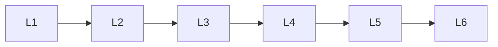

# Gans

> Deep lessons for the **Gans** section of the Generative AI handbook.

## Lessons

| # | Lesson |
|---|--------|
| 1 | [GAN Basics](01-gan-basics.md) |
| 2 | [Training Dynamics](02-training-dynamics.md) |
| 3 | [Mode Collapse](03-mode-collapse.md) |
| 4 | [DCGAN & StyleGAN](04-dcgan-and-stylegan.md) |
| 5 | [Conditional GANs](05-conditional-gans.md) |
| 6 | [GAN Evaluation](06-gan-evaluation.md) |

**Topic hub:** [../README.md](../README.md)
