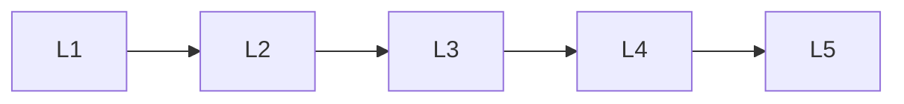

# Generative Ai Applications

> Deep lessons for the **Generative Ai Applications** section of the Generative AI handbook.

## Lessons

| # | Lesson |
|---|--------|
| 1 | [Content & Media](01-content-and-media.md) |
| 2 | [Copilots & Assistants](02-copilots-and-assistants.md) |
| 3 | [Enterprise Knowledge Apps](03-enterprise-knowledge-apps.md) |
| 4 | [Synthetic Data](04-synthetic-data.md) |
| 5 | [Creative Tools](05-creative-tools.md) |

**Topic hub:** [../README.md](../README.md)
