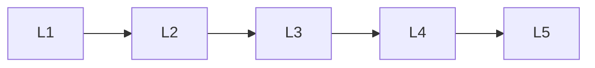

# Generative Ai Evaluation

> Deep lessons for the **Generative Ai Evaluation** section of the Generative AI handbook.

## Lessons

| # | Lesson |
|---|--------|
| 1 | [Evaluation Challenges](01-evaluation-challenges.md) |
| 2 | [Automatic Metrics](02-automatic-metrics.md) |
| 3 | [Human Preference Eval](03-human-preference-eval.md) |
| 4 | [Faithfulness & Grounding](04-faithfulness-and-grounding.md) |
| 5 | [Online Evaluation](05-online-evaluation.md) |

**Topic hub:** [../README.md](../README.md)
