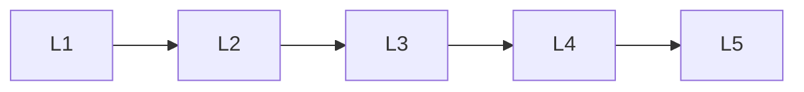

# Generative Ai Fine Tuning

> Deep lessons for the **Generative Ai Fine Tuning** section of the Generative AI handbook.

## Lessons

| # | Lesson |
|---|--------|
| 1 | [Why Fine-Tune Generators](01-why-finetune-generators.md) |
| 2 | [LoRA for Diffusion & LLMs](02-lora-for-diffusion-and-llms.md) |
| 3 | [DreamBooth & Personalization](03-dreambooth-and-personalization.md) |
| 4 | [Preference Tuning for GenAI](04-preference-tuning-for-genai.md) |
| 5 | [Dataset Curation for GenAI](05-dataset-curation-for-genai.md) |

**Topic hub:** [../README.md](../README.md)
