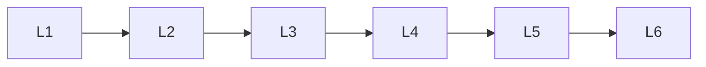

# Generative Ai Fundamentals

> Deep lessons for the **Generative Ai Fundamentals** section of the Generative AI handbook.

## Lessons

| # | Lesson |
|---|--------|
| 1 | [What is Generative AI](01-what-is-generative-ai.md) |
| 2 | [Discriminative vs Generative](02-discriminative-vs-generative.md) |
| 3 | [Modalities Overview](03-modalities-overview.md) |
| 4 | [Conditioning & Control](04-conditioning-and-control.md) |
| 5 | [Sampling & Latent Space](05-sampling-and-latent-space.md) |
| 6 | [GenAI System Loop](06-genai-system-loop.md) |

**Topic hub:** [../README.md](../README.md)
