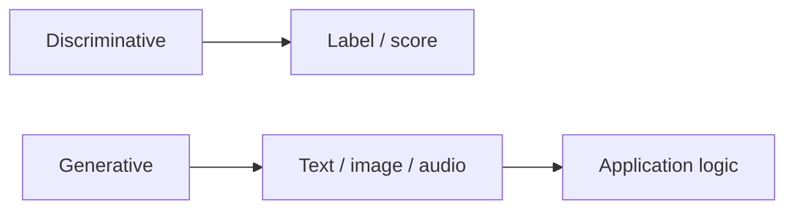

# Generative AI Overview

> What generative AI is, how it differs from discriminative ML, and the engineering stakes.

## Definition

Discriminative models predict labels; generative models produce new artifacts. GenAI systems combine a foundation model, conditioning (prompts/images), decoding/sampling, and application logic (tools, RAG, UI).

## Why it matters

Most modern AI products are GenAI products. The failure modes (hallucination, IP risk, abuse) are product risks, not demos.

## How it works

## Key principles

1. **Control the interface** — Prompt + tools + schemas beat vibes.
2. **Measure generations** — Automatic + human eval.
3. **Assume misuse** — Design abuse and data-exfil defenses.

## Common applications

| Application | Description |
|-------------|-------------|
| Copilots | Code/text assistance |
| Content pipelines | Marketing, support drafts |
| Multimodal apps | Image+text workflows |

## Common mistakes

- Shipping without eval or abuse plan
- Treating model output as trusted data

## Further reading

- [Productizing GenAI](productizing-generative-ai.md)
- [Prompt Engineering](../prompt-engineering/README.md)
