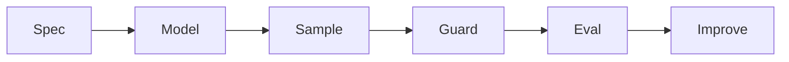

# Generative AI Overview

> A map of generative paradigms, modalities, and the product loop from sample to shipped feature.

## Table of Contents

- [Definition](#definition)
- [Why It Matters](#why-it-matters)
- [Map of This Handbook](#map-of-this-handbook)
- [System Loop](#system-loop)
- [Python Skeleton](#python-skeleton)
- [Production Checklist](#production-checklist)
- [Navigation](#navigation)

## Definition

**Generative AI Overview** — A map of generative paradigms, modalities, and the product loop from sample to shipped feature.

## Why It Matters

Without a shared map, teams confuse demos with production systems and pick the wrong modality stack.

## Map of This Handbook

1. Fundamentals and generative model families
2. GANs, VAEs, diffusion
3. Text / image / video / audio / multimodal
4. Fine-tuning, evaluation, applications, safety

## System Loop



## Python Skeleton

```python
def genai_feature(request: dict) -> dict:
    # 1 validate + auth
    # 2 build conditioning
    # 3 sample
    # 4 filter
    # 5 log metrics
    return {"ok": True, "echo": request}
```

## Production Checklist

- [ ] Modality and SLO documented
- [ ] Offline golden set
- [ ] Safety filters
- [ ] Cost quotas
- [ ] Canary + rollback

## Navigation

- [Generative AI hub](README.md)
