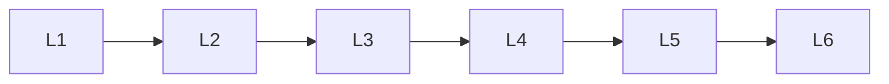

# Generative Ai Safety

> Deep lessons for the **Generative Ai Safety** section of the Generative AI handbook.

## Lessons

| # | Lesson |
|---|--------|
| 1 | [GenAI Risk Landscape](01-genai-risk-landscape.md) |
| 2 | [Deepfakes & Misinformation](02-deepfakes-and-misinformation.md) |
| 3 | [IP & Consent](03-ip-and-consent.md) |
| 4 | [Content Filters & Policies](04-content-filters-and-policies.md) |
| 5 | [Provenance & Watermarking](05-provenance-and-watermarking.md) |
| 6 | [Secure GenAI Apps](06-secure-genai-apps.md) |

**Topic hub:** [../README.md](../README.md)
