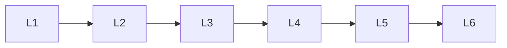

# Generative Models

> Deep lessons for the **Generative Models** section of the Generative AI handbook.

## Lessons

| # | Lesson |
|---|--------|
| 1 | [Generative Modeling Basics](01-generative-modeling-basics.md) |
| 2 | [Likelihood-Based Models](02-likelihood-based-models.md) |
| 3 | [Implicit Generative Models](03-implicit-generative-models.md) |
| 4 | [Autoregressive Generators](04-autoregressive-generators.md) |
| 5 | [Energy & Score-Based Models](05-energy-and-score-based-models.md) |
| 6 | [Choosing a Generative Paradigm](06-choosing-a-generative-paradigm.md) |

**Topic hub:** [../README.md](../README.md)
