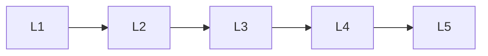

# Image Generation

> Deep lessons for the **Image Generation** section of the Generative AI handbook.

## Lessons

| # | Lesson |
|---|--------|
| 1 | [Image Generation Basics](01-image-generation-basics.md) |
| 2 | [Text-to-Image](02-text-to-image.md) |
| 3 | [Image Editing & Inpainting](03-image-editing-and-inpainting.md) |
| 4 | [Image Quality & Artifacts](04-image-quality-and-artifacts.md) |
| 5 | [Safety for Images](05-safety-for-images.md) |

**Topic hub:** [../README.md](../README.md)
