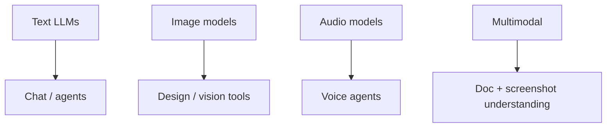

# Modalities and Model Types

> Text, image, audio, and multimodal generators — a field guide.

## Definition

Generative modalities include text (autoregressive LMs), images (diffusion / autoregressive vision), audio/speech, and multimodal models that accept/produce mixed inputs. Each has different latency, cost, and safety profiles.

## Why it matters

Product architecture changes with modality: image gens need asset storage/CDN; voice needs streaming audio; text needs citation/RAG patterns.

## How it works

## Key principles

1. **Pick modality from UX** — Don't force chat if a form+model is better.
2. **Budget generation cost** — Images/video can dwarf text costs.
3. **Separate understanding vs generation** — VLM understand ≠ image generate.

## Common applications

| Application | Description |
|-------------|-------------|
| Support bots | Text ± voice |
| Creative tools | Image/video |
| Document AI | Multimodal PDF/screenshot QA |

## Common mistakes

- One mega-prompt for every modality without specialized eval
- Ignoring content credentials / provenance needs

## Further reading

- [LLM Application Development](../llm-application-development/README.md)
- [AI System Design](../ai-system-design/README.md)
