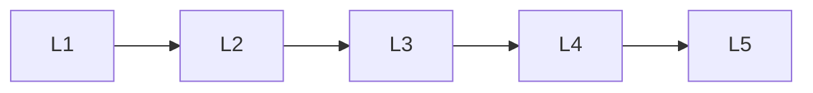

# Multimodal Generative Ai

> Deep lessons for the **Multimodal Generative Ai** section of the Generative AI handbook.

## Lessons

| # | Lesson |
|---|--------|
| 1 | [Multimodal Basics](01-multimodal-basics.md) |
| 2 | [Vision-Language Models](02-vision-language-models.md) |
| 3 | [Any-to-Any Generation](03-any-to-any-generation.md) |
| 4 | [Alignment Across Modalities](04-alignment-across-modalities.md) |
| 5 | [Multimodal Product Patterns](05-multimodal-product-patterns.md) |

**Topic hub:** [../README.md](../README.md)
