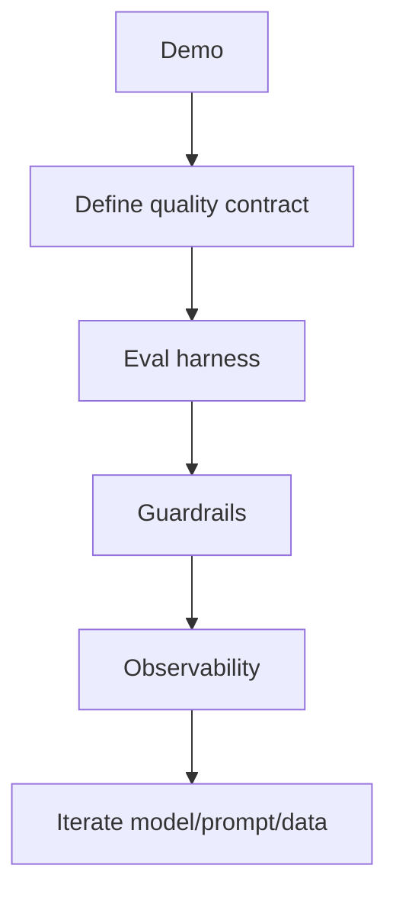

# Productizing Generative AI

> From demo to durable product — UX, eval, safety, and ops.

## Definition

Productizing GenAI means wrapping a model with product constraints: latency SLOs, cost caps, groundedness, human review, versioning, and feedback loops.

## Why it matters

Demos optimize wow; products optimize reliability. The gap is engineering.

## How it works

## Key principles

1. **Write a quality contract** — What must never happen?
2. **Version prompts & models** — Reproducible deploys.
3. **Close the loop** — Capture failures into golden sets.

## Common applications

| Application | Description |
|-------------|-------------|
| Customer support | Grounded answers + escalate |
| Internal copilots | Permissions-aware tools |
| Content generation | Brand/style checkers |

## Common mistakes

- No rollback plan when a prompt change ships
- Logging sensitive prompts without redaction policy

## Further reading

- [MLOps & LLMOps](../mlops-llmops/README.md)
- [AI Security & Guardrails](../ai-security-guardrails/README.md)
