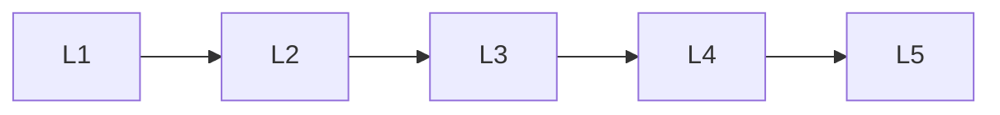

# Text Generation

> Deep lessons for the **Text Generation** section of the Generative AI handbook.

## Lessons

| # | Lesson |
|---|--------|
| 1 | [Text Generation Basics](01-text-generation-basics.md) |
| 2 | [LLM Generators](02-llm-generators.md) |
| 3 | [Decoding for Generation](03-decoding-for-generation.md) |
| 4 | [Controllable Text Generation](04-controllable-text-generation.md) |
| 5 | [Code & Structured Generation](05-code-and-structured-generation.md) |

**Topic hub:** [../README.md](../README.md)
