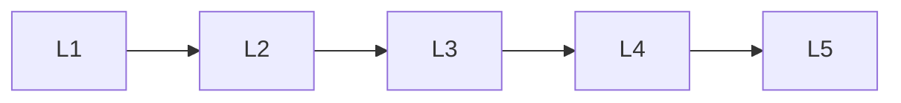

# Vaes

> Deep lessons for the **Vaes** section of the Generative AI handbook.

## Lessons

| # | Lesson |
|---|--------|
| 1 | [VAE Basics](01-vae-basics.md) |
| 2 | [Encoder, Decoder & Latents](02-encoder-decoder-latents.md) |
| 3 | [ELBO & KL Regularization](03-elbo-and-kl.md) |
| 4 | [β-VAE & Disentangling](04-beta-vae-and-disentangling.md) |
| 5 | [VAE vs GAN vs Diffusion](05-vae-vs-gan-vs-diffusion.md) |

**Topic hub:** [../README.md](../README.md)
