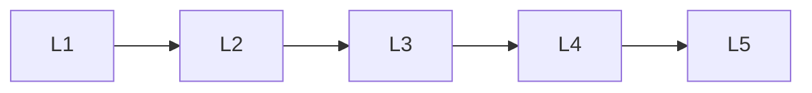

# Video Generation

> Deep lessons for the **Video Generation** section of the Generative AI handbook.

## Lessons

| # | Lesson |
|---|--------|
| 1 | [Video Generation Basics](01-video-generation-basics.md) |
| 2 | [Text-to-Video](02-text-to-video.md) |
| 3 | [Image-to-Video](03-image-to-video.md) |
| 4 | [Temporal Consistency](04-temporal-consistency.md) |
| 5 | [Video Eval & Cost](05-video-eval-and-cost.md) |

**Topic hub:** [../README.md](../README.md)
