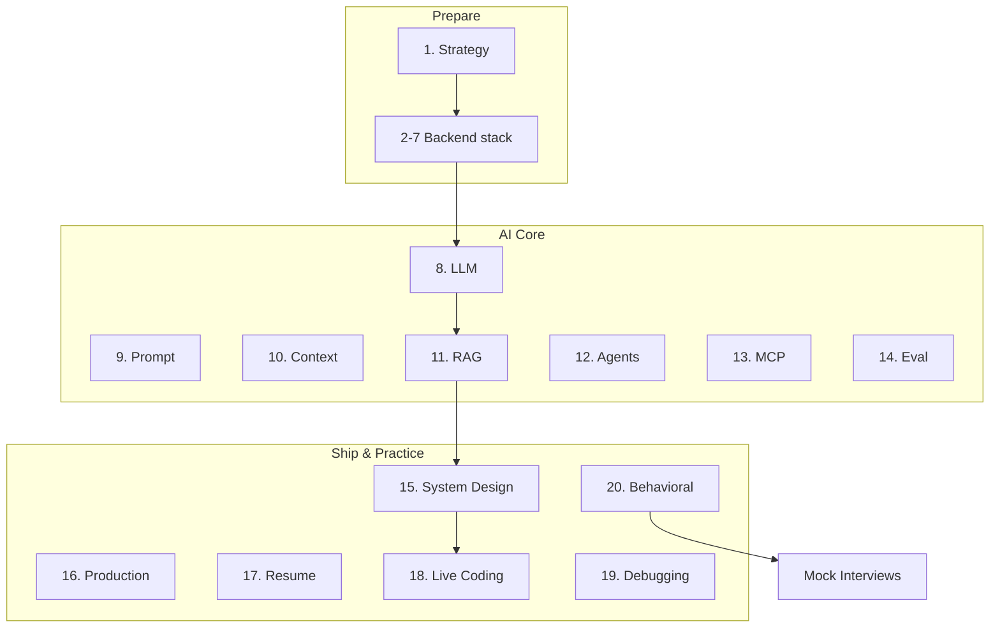

# AI Engineering Interview Handbook

> Definitive interview preparation system — technical, coding, architecture, debugging, behavioral, and system design.
> **Prerequisites:** Playbook phases 2–12 for depth; this module teaches **interview articulation**.

---

## Module Overview

---

## Documents (20 Sections)

| # | Topic | Document |
|---|-------|----------|
| 1 | Strategy | [interview-strategy.md](interview-strategy.md) |
| 2 | Python | [python-interviews.md](python-interviews.md) |
| 3 | FastAPI | [fastapi-interviews.md](fastapi-interviews.md) |
| 4 | SQL | [sql-interviews.md](sql-interviews.md) |
| 5 | PostgreSQL | [postgresql-interviews.md](postgresql-interviews.md) |
| 6 | Redis | [redis-interviews.md](redis-interviews.md) |
| 7 | Docker | [docker-interviews.md](docker-interviews.md) |
| 8 | LLM Engineering | [llm-engineering-interviews.md](llm-engineering-interviews.md) |
| 9 | Prompt Engineering | [prompt-engineering-interviews.md](prompt-engineering-interviews.md) |
| 10 | Context Engineering | [context-engineering-interviews.md](context-engineering-interviews.md) |
| 11 | RAG | [rag-interviews.md](rag-interviews.md) |
| 12 | AI Agents | [ai-agents-interviews.md](ai-agents-interviews.md) |
| 13 | MCP | [mcp-interviews.md](mcp-interviews.md) |
| 14 | AI Evaluation | [ai-evaluation-interviews.md](ai-evaluation-interviews.md) |
| 15 | System Design | [system-design-interview-guide.md](system-design-interview-guide.md) |
| 16 | Production AI | [production-ai-interviews.md](production-ai-interviews.md) |
| 17 | Resume & Projects | [resume-project-interviews.md](resume-project-interviews.md) |
| 18 | Live / Machine Coding | [live-coding-machine-coding.md](live-coding-machine-coding.md) |
| 19 | Debugging | [debugging-interviews.md](debugging-interviews.md) |
| 20 | Behavioral & Leadership | [behavioral-leadership-interviews.md](behavioral-leadership-interviews.md) |

### Practice Packs

| Pack | Document |
|------|----------|
| Mock Interviews (Junior → Staff) | [mock-interviews.md](mock-interviews.md) |
| Company Patterns | [company-interview-patterns.md](company-interview-patterns.md) |

---

## Cheat Sheets

- [Python](../../cheat-sheets/interview-python-cheat-sheet.md) · [FastAPI](../../cheat-sheets/interview-fastapi-cheat-sheet.md)
- [SQL](../../cheat-sheets/interview-sql-cheat-sheet.md) · [PostgreSQL](../../cheat-sheets/interview-postgresql-cheat-sheet.md)
- [Redis](../../cheat-sheets/interview-redis-cheat-sheet.md) · [Docker](../../cheat-sheets/interview-docker-cheat-sheet.md)
- [LLM](../../cheat-sheets/interview-llm-cheat-sheet.md) · [RAG](../../cheat-sheets/interview-rag-cheat-sheet.md)
- [Agents](../../cheat-sheets/interview-agents-cheat-sheet.md) · [MCP](../../cheat-sheets/interview-mcp-cheat-sheet.md)
- [Evaluation](../../cheat-sheets/interview-evaluation-cheat-sheet.md) · [System Design](../../cheat-sheets/interview-system-design-cheat-sheet.md)

---

## Learning Path

1. **Week 1–2:** Strategy + backend sections (1–7)
2. **Week 3–4:** AI core (8–14) — review linked playbook phases
3. **Week 5:** System design + production (15–16)
4. **Week 6:** Resume, coding, debugging (17–19)
5. **Week 7:** Behavioral + mocks (20, mock packs)

---

## Cross-Links to Playbook Phases

| Interview section | Deep dive phase |
|-------------------|-----------------|
| RAG | [Phase 7](../rag/README.md) |
| Agents | [Phase 8](../ai-agents/README.md) |
| MCP | [Phase 9](../mcp/README.md) |
| Evaluation | [Phase 10](../ai-evaluation/README.md) |
| System Design | [Phase 11](../ai-system-design/README.md) |
| Production | [Phase 12](../ai-deployment/README.md) |

---

## Completion Checklist

- [ ] Complete one mock interview at target level
- [ ] Whiteboard one system from Section 15
- [ ] Prepare 5 STAR behavioral stories
- [ ] One-page architecture for top resume project
- [ ] Review all cheat sheets before onsite

---

## See Also

- [Master Index](../../meta/indexes/MASTER-INDEX.md) · [Career Notes](../career-notes/README.md)
