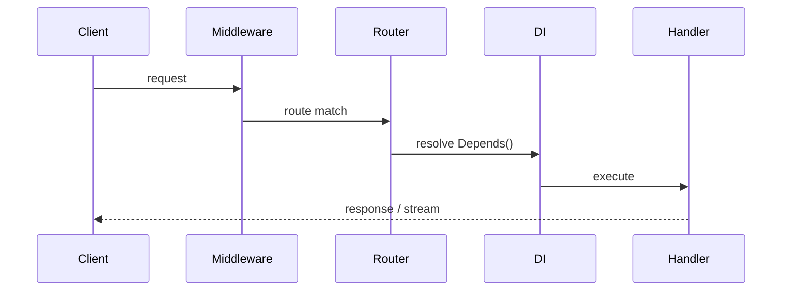

# FastAPI Interviews for AI Engineers

## Overview

Section **3**. Most AI backends use **FastAPI** for async I/O and Pydantic validation.

## Core Concepts



| Topic | Key point |
|-------|-----------|
| **Request lifecycle** | ASGI → middleware → route → deps → handler |
| **Dependency Injection** | `Depends(get_db)` — testable, per-request |
| **Validation** | Pydantic models = API + LLM structured output |
| **Background tasks** | `BackgroundTasks` for fire-and-forget indexing |
| **Streaming** | `StreamingResponse` for SSE token streams |
| **WebSockets** | Bidirectional; voice/collab |

## FAQ

**Q: How implement streaming chat endpoint?**

```python
from fastapi.responses import StreamingResponse

async def token_stream():
    async for chunk in llm_stream():
        yield f"data: {chunk}\n\n"

@app.post("/chat/stream")
async def chat_stream():
    return StreamingResponse(token_stream(), media_type="text/event-stream")
```

**Follow-up:** How handle client disconnect?

> Check `request.is_disconnected()` in loop; cancel LLM task.

**Q: Where put auth?**

> Dependency: `Depends(get_current_user)` on router or route.

**Q: How test FastAPI without running server?**

> `TestClient(app)` or `httpx.AsyncClient` with ASGI transport.

## Machine Coding Prompt

> Build POST `/rag/query` — body: `question`; returns answer + source IDs; validate input; 30s timeout.

**Outline:** Pydantic model → retrieve → LLM → response model; dependency for vector client.

## Seniority

- **Mid:** routes, DI, Pydantic
- **Senior:** streaming, middleware, prod deployment

## Further Reading

- [FastAPI Domain](../fastapi/README.md) · [Backend](../backend-engineering/README.md)

---

## Changelog

| Version | Date | Changes |
|---------|------|---------|
| 1.0 | 2026-07-13 | Section 3 |
