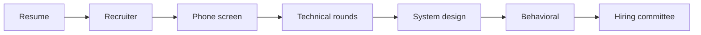

# AI Engineering Interview Strategy

## Overview

Section **1** of the AI Engineering Interview Handbook — a complete preparation **system**, not a question list.

> **Prerequisites:** Complete playbook phases 2–12 for depth; use this module to **practice articulation** under interview constraints.

## AI Engineering Interview Process

| Stage | What they assess | Duration |
|-------|------------------|----------|
| **Resume screen** | Impact, stack, AI relevance | Async |
| **Recruiter** | Communication, level, motivation | 30 min |
| **Technical** | Coding, debugging, domain depth | 45–60 min × 2–4 |
| **Architecture** | RAG, agents, system design | 45–60 min |
| **Behavioral** | Ownership, collaboration | 30–45 min |
| **Hiring committee** | Level calibration, packet | Internal |

## Preparation Roadmap (8 weeks)

| Week | Focus |
|------|-------|
| 1–2 | Python, SQL, FastAPI refresh |
| 3 | LLM, prompts, context |
| 4 | RAG + evaluation |
| 5 | Agents + MCP |
| 6 | System design whiteboards |
| 7 | Production AI + debugging |
| 8 | Mock interviews + behavioral |

## Technical Interview Types

| Type | Format | Prep doc |
|------|--------|----------|
| **Live coding** | Shared editor | [Live Coding](live-coding-machine-coding.md) |
| **Machine coding** | Build feature 60–90 min | [Live Coding](live-coding-machine-coding.md) |
| **Debugging** | Broken prod scenario | [Debugging](debugging-interviews.md) |
| **System design** | Whiteboard | [System Design](system-design-interview-guide.md) |

## Common Candidate Mistakes

| Mistake | Fix |
|---------|-----|
| Jumping to code without clarifying | Ask requirements first |
| No tradeoffs on RAG vs fine-tune | State assumptions + compare |
| Can't explain own resume project | Prepare STAR + architecture one-pager |
| Ignoring latency/cost in design | Budget every layer |
| Memorizing answers without understanding | Link to playbook phases |

## Interview Tips

1. Think aloud — interviewers grade process
2. Write assumptions on the board
3. Start simple, iterate
4. Name metrics: p95 latency, faithfulness, cost/request
5. Ask 2–3 clarifying questions before designing

## Expected Seniority

| Level | Expectation |
|-------|-------------|
| **Junior** | Implement RAG snippet; explain tokens |
| **Mid** | Design small feature end-to-end |
| **Senior** | System design + production concerns |
| **Staff** | Cross-team tradeoffs, platform thinking |

## Related Topics

- [Mock Interviews](mock-interviews.md) · [Company Patterns](company-interview-patterns.md)

---

## Changelog

| Version | Date | Changes |
|---------|------|---------|
| 1.0 | 2026-07-13 | Section 1 |
