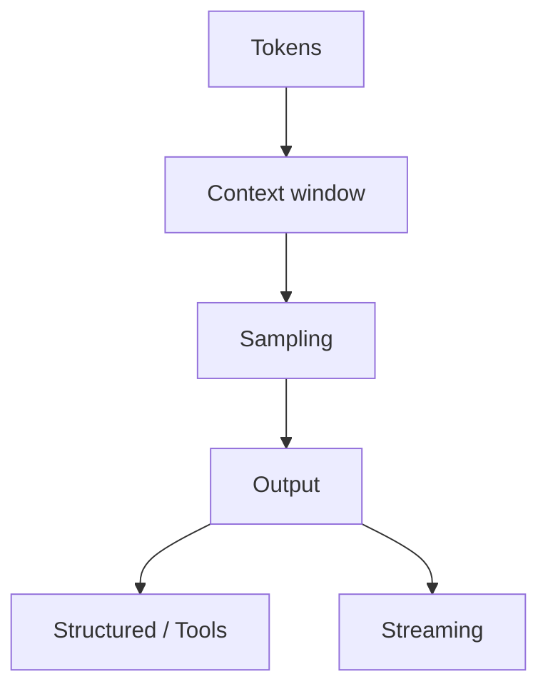

# LLM Engineering Interviews

## Overview

Section **8** — one of the largest interview chapters.

## Core Concepts Map

| Topic | Must-know |
|-------|-----------|
| **Tokens** | Billing unit; ~4 chars EN; tokenizer-specific |
| **Context window** | Input + output limit; trim/summarize |
| **Temperature** | Randomness; 0 = deterministic |
| **Top-p / top-k** | Nucleus sampling |
| **KV cache** | Speeds autoregressive decode |
| **Structured outputs** | JSON schema / Pydantic |
| **Function calling** | Model emits tool calls |
| **Streaming** | TTFT vs total latency |
| **Vision** | Image tokens in context |
| **Cost** | Input vs output price differs |

## FAQ

**Q: Temperature 0 but different outputs?**

> Non-determinism from hardware, batching, provider; some models still sample; use seed if supported.

**Q: When use structured outputs vs prompting JSON?**

> Schema enforcement reduces parse errors; use native API mode when available.

**Q: Explain KV cache.**

> Stores attention keys/values for prior tokens so regeneration doesn't recompute — critical for long prompts + fast inference.

**Architecture Q:** Route 80% traffic to small model?

> Intent classifier (cheap) → simple FAQ to small LLM; complex to frontier model.

## Coding Exercise

Parse tool call JSON from model response; validate with Pydantic; handle malformed output.

## Trick Question

**Q: More context always better?**

> No — noise hurts retrieval quality; cost/latency increase; "lost in the middle" effect.

## Seniority

- **Junior:** tokens, temperature, basic API call
- **Senior:** routing, cost, streaming, tool loops

## Further Reading

- [LLM Engineering](../llm-engineering/README.md)

---

## Changelog

| Version | Date | Changes |
|---------|------|---------|
| 1.0 | 2026-07-13 | Section 8 |
