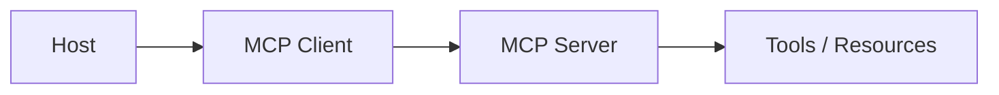

# MCP Interviews for AI Engineers

## Overview

Section **13**.

## FAQ

**Q: MCP vs REST for AI tools?**

> MCP: discovery, standardized primitives (tools/resources/prompts), session negotiation. REST: general purpose — more custom per integration.

**Q: STDIO vs HTTP transport?**

> STDIO: local IDE subprocess. HTTP: remote SaaS, scale-out servers.

**Q: Secure MCP in enterprise?**

> Auth at transport; per-tool RBAC; audit `tools/call`; sandbox servers.

**Implementation Q:** Design multi-server client.

> Router maps tool name → server session; namespace prefixes; isolated failure domains.

## Further Reading

- [MCP Handbook](../mcp/README.md)

---

## Changelog

| Version | Date | Changes |
|---------|------|---------|
| 1.0 | 2026-07-13 | Section 13 |
