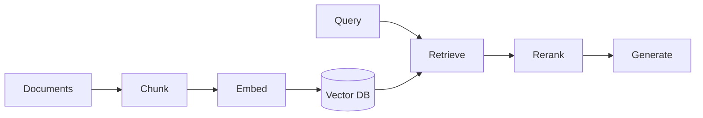

# RAG Interviews for AI Engineers

## Overview

Section **11** — largest AI-specific interview chapter.

## Topic Question Bank

| Topic | Sample question | Answer sketch |
|-------|-----------------|---------------|
| **Chunking** | Fixed vs semantic? | Semantic preserves meaning; fixed simpler; overlap 10–20% |
| **Embeddings** | Same model query/doc? | Usually yes; must match index model |
| **Hybrid** | Why BM25 + vector? | Lexical exact match + semantic paraphrase |
| **Reranking** | Cross-encoder cost? | Better precision@k; use on top-50 only |
| **Hallucination** | Prevent in RAG? | Faithfulness eval; cite sources; abstain |
| **Citations** | How verify? | Match claim to chunk text |
| **GraphRAG** | When? | Entity-heavy corpora, multi-hop |
| **Self-RAG** | Idea? | Model retrieves/critiques own retrieval |
| **Agentic RAG** | Idea? | Agent decides when/what to retrieve |

## Architecture Question

**Design RAG for 10M PDFs enterprise ACL.**

> Ingest pipeline with metadata ACL; filter at retrieval; per-tenant indexes or metadata filters; eval faithfulness; hybrid search; reranker; cache hot queries.

## Coding Exercise

Implement: embed query → cosine top-k from numpy matrix → return doc IDs.

## Trick Question

**Q: Higher retrieval score always better answer?**

> No — wrong chunk can score high; need rerank + faithfulness check.

## Seniority

- **Mid:** explain pipeline end-to-end
- **Senior:** hybrid, eval, production failure modes

## Further Reading

- [RAG Handbook](../rag/README.md) · [System Design PDF](system-design-interview-guide.md#ai-pdf-chat)

---

## Changelog

| Version | Date | Changes |
|---------|------|---------|
| 1.0 | 2026-07-13 | Section 11 |
