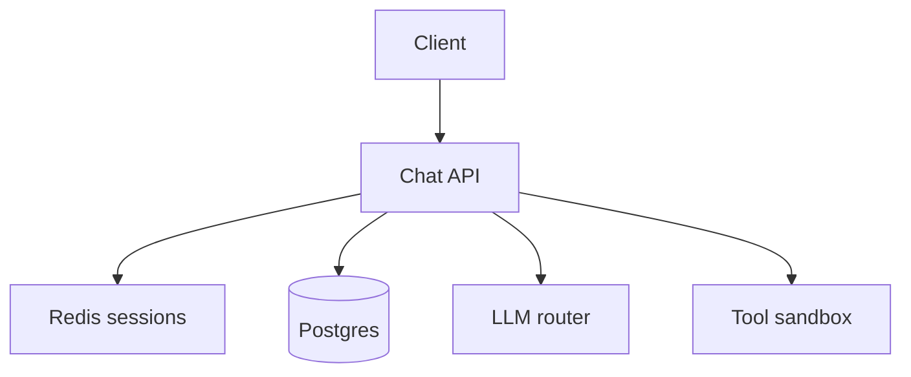

# AI System Design Interview Guide

## Overview

Section **15** — interview exercises linked to [designs](../ai-system-design/README.md).

## Whiteboard Framework (45 min)

1. Requirements (5) — functional + NFR + scale
2. Estimate (5) — QPS, storage, tokens/day
3. Diagram (10) — clients, API, data, LLM
4. Deep dives (20) — 2–3 components
5. Wrap (5) — bottlenecks, monitoring, failures

## System Exercise Index

| System | Design doc | Key interview focus |
|--------|------------|---------------------|
| **ChatGPT** | [design-chatgpt-like](../ai-system-design/design-chatgpt-like-system.md) | Streaming, memory, tools |
| **Cursor** | [design-cursor-like](../ai-system-design/design-cursor-like-system.md) | Indexing, agent edits |
| **Copilot** | [design-github-copilot](../ai-system-design/design-github-copilot.md) | Latency, FIM |
| **Perplexity** | [design-perplexity](../ai-system-design/design-perplexity-ai-search.md) | Citations, web search |
| **Deep Research** | [design-deep-research](../ai-system-design/design-deep-research-system.md) | Long jobs, multi-agent |
| **AI Search** | [design-ai-search-engine](../ai-system-design/design-ai-search-engine.md) | Hybrid retrieval |
| **Support** | [design-ai-customer-support](../ai-system-design/design-ai-customer-support.md) | Escalation, CRM |
| **PDF Chat** | [design-ai-pdf-chat](../ai-system-design/design-ai-pdf-chat.md) | Ingestion, OCR |
| **Voice** | [design-ai-voice-agent](../ai-system-design/design-ai-voice-agent.md) | STT/TTS pipeline |

## ChatGPT Exercise (sample)

**Requirements:** 1M DAU, multi-turn, streaming, tools.

**Capacity:** ~30–100 QPS peak; tokens/day = DAU × sessions × tokens.

**Architecture:**



**Tradeoffs:** Server-side history vs client-only.

**Failures:** LLM 503 → fallback model; stream disconnect → resume token.

## Capacity Estimation Template

```
Peak QPS = DAU × sessions/day × turns / 86400 × peak_factor
Postgres storage ≈ messages × avg_bytes × retention
```

## Further Reading

- [AI System Design Handbook](../ai-system-design/README.md)

---

## Changelog

| Version | Date | Changes |
|---------|------|---------|
| 1.0 | 2026-07-13 | Section 15 |
