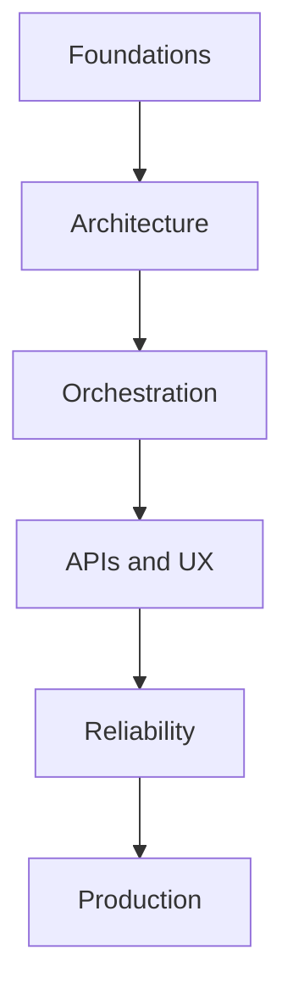

# LLM Application Development

> Building production applications around LLMs — APIs, orchestration, state, reliability, and the architecture patterns that work — restructured into the same nested Handbooks hierarchy as Prompt Engineering.

**Prerequisites:** [Python](../python-engineering/README.md) · [Prompt Engineering](../prompt-engineering/README.md) · [Large Language Models](../llm-engineering/README.md)  
**Unlocks:** [Chatbots](../chatbots/README.md) · [RAG](../rag/README.md) · [AI Agents](../ai-agents/README.md)

Start with a section hub below (or expand **11. LLM Application Development** in the left sidebar).

---

## Sections

| # | Section | What you will learn | Hub |
|---|---------|---------------------|-----|
| 1 | **Foundations** | App vs chat vs agent, request lifecycle, and sync/async/streaming execution models. | [foundations/](foundations/README.md) |
| 2 | **Architecture** | Reference architecture, layer boundaries, provider adapters, and multi-tenant LLM apps. | [architecture/](architecture/README.md) |
| 3 | **Orchestration** | Control-flow patterns: chains, routers, classifiers, and graph-based workflows. | [orchestration/](orchestration/README.md) |
| 4 | **APIs and UX** | Chat APIs, SSE streaming, tool-calling UX, and cancellation/timeouts. | [apis-and-ux/](apis-and-ux/README.md) |
| 5 | **Reliability** | Retries, idempotency, circuit breakers, fallbacks, and graceful degradation. | [reliability/](reliability/README.md) |
| 6 | **Production** | Ship checklists, config/feature flags, rollout, and observability hooks. | [production/](production/README.md) |

---

## Hierarchy

### 1. Foundations

| # | Topic |
|---|-------|
| 1 | [App vs Chat vs Agent](foundations/01-app-vs-chat-vs-agent.md) |
| 2 | [Request Lifecycle](foundations/02-request-lifecycle.md) |
| 3 | [Sync, Async, and Streaming](foundations/03-sync-async-streaming.md) |

### 2. Architecture

| # | Topic |
|---|-------|
| 1 | [LLM App Architecture](architecture/01-llm-app-architecture.md) |
| 2 | [Layers and Boundaries](architecture/02-layers-and-boundaries.md) |
| 3 | [Provider Adapters and Gateways](architecture/03-provider-adapters-and-gateways.md) |
| 4 | [Multi-Tenant LLM Apps](architecture/04-multi-tenant-llm-apps.md) |

### 3. Orchestration

| # | Topic |
|---|-------|
| 1 | [Orchestration Patterns](orchestration/01-orchestration-patterns.md) |
| 2 | [Chains and Pipelines](orchestration/02-chains-and-pipelines.md) |
| 3 | [Routers and Classifiers](orchestration/03-routers-and-classifiers.md) |
| 4 | [Graph-Based Workflows](orchestration/04-graph-based-workflows.md) |

### 4. APIs and UX

| # | Topic |
|---|-------|
| 1 | [Chat APIs](apis-and-ux/01-chat-apis.md) |
| 2 | [Streaming and SSE](apis-and-ux/02-streaming-and-sse.md) |
| 3 | [Tool-Calling UX](apis-and-ux/03-tool-calling-ux.md) |
| 4 | [Cancellation and Timeouts](apis-and-ux/04-cancellation-and-timeouts.md) |

### 5. Reliability

| # | Topic |
|---|-------|
| 1 | [Retries and Timeouts](reliability/01-retries-and-timeouts.md) |
| 2 | [Idempotency and Dedup](reliability/02-idempotency-and-dedup.md) |
| 3 | [Fallbacks and Circuit Breakers](reliability/03-fallbacks-and-circuit-breakers.md) |
| 4 | [Graceful Degradation](reliability/04-graceful-degradation.md) |

### 6. Production

| # | Topic |
|---|-------|
| 1 | [LLM App Building Checklist](production/01-llm-app-building-checklist.md) |
| 2 | [Config and Feature Flags](production/02-config-and-feature-flags.md) |
| 3 | [Release and Rollout](production/03-release-and-rollout.md) |
| 4 | [Observability Hooks](production/04-observability-hooks.md) |

---

## Definition

**LLM application development** is software engineering for products that call language models: request validation, prompt assembly, tool calls, retrieval, streaming UX, persistence, auth, and testing. The model is a dependency — your app owns correctness.

---

## Learning path

| Stage | Sections | Focus |
|-------|----------|-------|
| Foundations | 1 | Product shapes, lifecycle, execution modes |
| Architecture | 2 | Layers, adapters, multi-tenancy |
| Orchestration | 3 | Chains, routers, graphs |
| APIs & UX | 4 | Chat APIs, SSE, tools, cancel |
| Reliability | 5 | Retries, idempotency, breakers, degradation |
| Production | 6 | Checklist, flags, rollout, observability |

**Milestone:** A flagged, observable chat or app feature with adapters, budgets, golden eval in CI, and a documented degradation mode.

---

## Related topics

- [Backend Engineering](../backend-engineering/README.md)
- [FastAPI](../fastapi/README.md)
- [APIs](../apis/README.md)
- [Context Engineering](../context-engineering/README.md)
- [AI System Design](../ai-system-design/README.md)

---

## See also

- [Domains overview](../README.md)
- [Learning Roadmap](../../meta/roadmap.md)
- [Master Index](../../meta/indexes/MASTER-INDEX.md)
