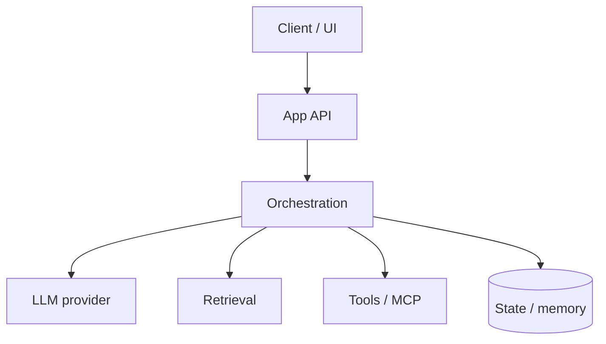

# LLM Application Development

> Building production applications around LLMs — APIs, orchestration, state, and the app architecture patterns that work.

**Prerequisites:** [Python](../python-engineering/README.md) · [Prompt Engineering](../prompt-engineering/README.md) · [Large Language Models](../llm-engineering/README.md)  
**Unlocks:** [Chatbots](../chatbots/README.md) · [RAG](../rag/README.md) · [AI Agents](../ai-agents/README.md)

---

## Definition

**LLM application development** is software engineering for products that call language models: request validation, prompt assembly, tool calls, retrieval, streaming UX, persistence, auth, and testing. The model is a dependency — your app owns correctness.

---

## Learning path

---

## Documents

| # | Topic | Document |
|---|-------|----------|
| 1 | LLM app architecture | [llm-app-architecture.md](llm-app-architecture.md) |
| 2 | Orchestration patterns | [orchestration-patterns.md](orchestration-patterns.md) |
| 3 | Building checklist | [llm-app-building-checklist.md](llm-app-building-checklist.md) |

---

## Related topics

- [Backend Engineering](../backend-engineering/README.md)
- [FastAPI](../fastapi/README.md)
- [APIs](../apis/README.md)
- [Context Engineering](../context-engineering/README.md)

---

## See also

- [Domains overview](../README.md)
- [Learning Roadmap](../../meta/roadmap.md)
- [Master Index](../../meta/indexes/MASTER-INDEX.md)
