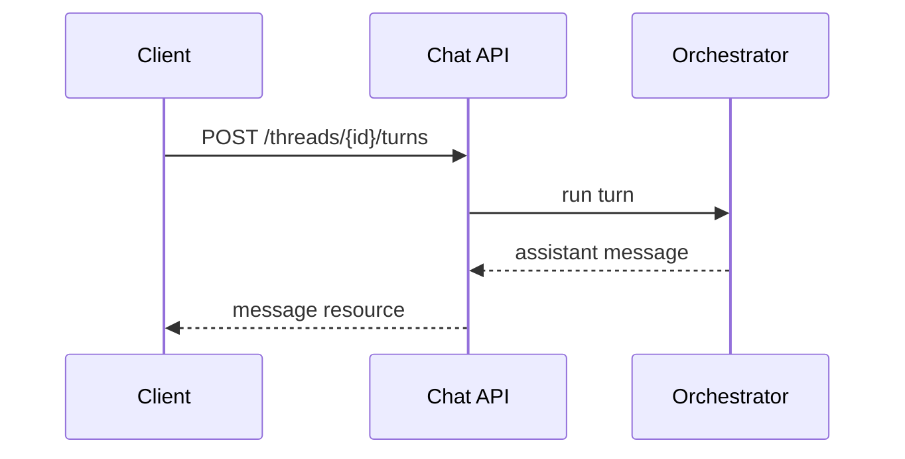

# Chat APIs

> Chat APIs are product contracts — threads, messages, and turns — not thin wrappers around a vendor chat completions endpoint.

## Table of Contents

- [Overview](#overview)
- [Definition](#definition)
- [Why it matters](#why-it-matters)
- [Uses](#uses)
- [How it works](#how-it-works)
- [Worked examples / scenarios](#worked-examples-scenarios)
- [Python Examples](#python-examples)
- [Production Considerations](#production-considerations)
- [Performance Considerations](#performance-considerations)
- [Cost Considerations](#cost-considerations)
- [Security Considerations](#security-considerations)
- [Best Practices](#best-practices)
- [Common Mistakes](#common-mistakes)
- [Interview Preparation](#interview-preparation)
- [Navigation](#navigation)

---

## Overview

Exposing raw vendor payloads couples clients to OpenAI (or others). A good chat API models **threads**, **messages**, and **turns** as your resources, with authz and pagination.

```mermaid
flowchart LR
  Client --> Threads[/threads]
  Client --> Messages[/threads/id/messages]
  Client --> Turns[/threads/id/turns]
```

> **Prerequisites:** [Request Lifecycle](../../foundations/02-request-lifecycle.md) · [APIs](../../apis/README.md)

---

## Definition

A **chat API** is the application-level HTTP contract for conversational LLM features: creating threads, appending user messages, running assistant turns, listing history, and managing metadata — independent of any single model vendor.

---

## Why it matters

| Thin vendor wrap | Product chat API |
|------------------|------------------|
| Clients break on vendor change | Stable resources |
| No thread authz model | Per-thread ACLs |
| Hard to add tools/UX events | First-class turn events |

---

## Uses

| Endpoint | Purpose |
|----------|---------|
| `POST /threads` | Create conversation |
| `POST /threads/{id}/turns` | User message → assistant reply |
| `GET /threads/{id}/messages` | Paginated history |
| `POST /threads/{id}/cancel` | Abort in-flight turn |

---

## How it works

### Resource model

- **Thread** — container with `tenant_id`, title, model preferences.
- **Message** — role, content parts, tool calls, timestamps.
- **Turn** — unit of work producing one assistant message (and tool events).



### Idempotency

Accept `Idempotency-Key` on turn creation to prevent double sends on mobile retries.

---

## Worked examples / scenarios

### Mobile retry

Client times out, retries same turn with same idempotency key → server returns original assistant message, does not call the model twice.

### Shared thread

Two users in a workspace; API enforces membership before reads/writes.

---

## Python Examples

### FastAPI sketch

```python
@app.post("/v1/threads")
async def create_thread(user=Depends(auth)):
    thread = await threads.create(tenant_id=user.tenant_id, user_id=user.id)
    return thread

@app.post("/v1/threads/{thread_id}/turns")
async def create_turn(
    thread_id: str,
    body: TurnCreate,
    request: Request,
    user=Depends(auth),
):
    await threads.assert_member(thread_id, user.id)
    key = request.headers.get("idempotency-key")
    return await chat_service.run_turn(user, thread_id, body.message, idem_key=key)
```

### Message DTO

```python
class MessageOut(BaseModel):
    id: str
    role: Literal["user", "assistant", "system", "tool"]
    content: str
    created_at: datetime
    tool_calls: list[dict] | None = None
```

---

## Production Considerations

- Version the API (`/v1`); changelog for message part types.
- Cursor pagination for messages, not huge offsets.

## Performance Considerations

- Index `(thread_id, created_at)`.
- Avoid loading full history when only appending.

## Cost Considerations

- Return `usage` on turns for client budgeting UIs.
- Cap message size in the schema.

## Security Considerations

- Membership checks on every thread route.
- Strip internal tool credentials from message payloads.

---

## Best Practices

1. Design resources around UX nouns.
2. Separate create-message from run-turn if offline drafts exist.
3. Include `request_id` in error bodies.
4. Document streaming as the same turn resource with events.

## Common Mistakes

- Returning raw OpenAI response JSON to clients
- No idempotency on turns
- Unbounded history GET
- Forgetting soft-delete / retention policies

---

## Interview Preparation

**Q: Why not expose chat.completions directly to the browser?**  
**A:** It leaks keys/models, skips your authz and persistence, and couples UX to vendor schemas.


---

## Navigation

### This section — APIs and UX

| # | Topic | Document |
|---|-------|----------|
| 1 | Chat APIs | **You are here** |
| 2 | Streaming and SSE | [Streaming and SSE](02-streaming-and-sse.md) |
| 3 | Tool-Calling UX | [Tool-Calling UX](03-tool-calling-ux.md) |
| 4 | Cancellation and Timeouts | [Cancellation and Timeouts](04-cancellation-and-timeouts.md) |

### Path

- Previous: [Graph-Based Workflows](../orchestration/04-graph-based-workflows.md)
- Next: [Streaming and SSE](02-streaming-and-sse.md)
- Section hub: [APIs and UX](README.md)
- Domain hub: [LLM Application Development](../README.md)

### Related topics

- [Streaming and SSE](02-streaming-and-sse.md)
- [FastAPI](../../fastapi/README.md)
- [APIs](../../apis/README.md)

