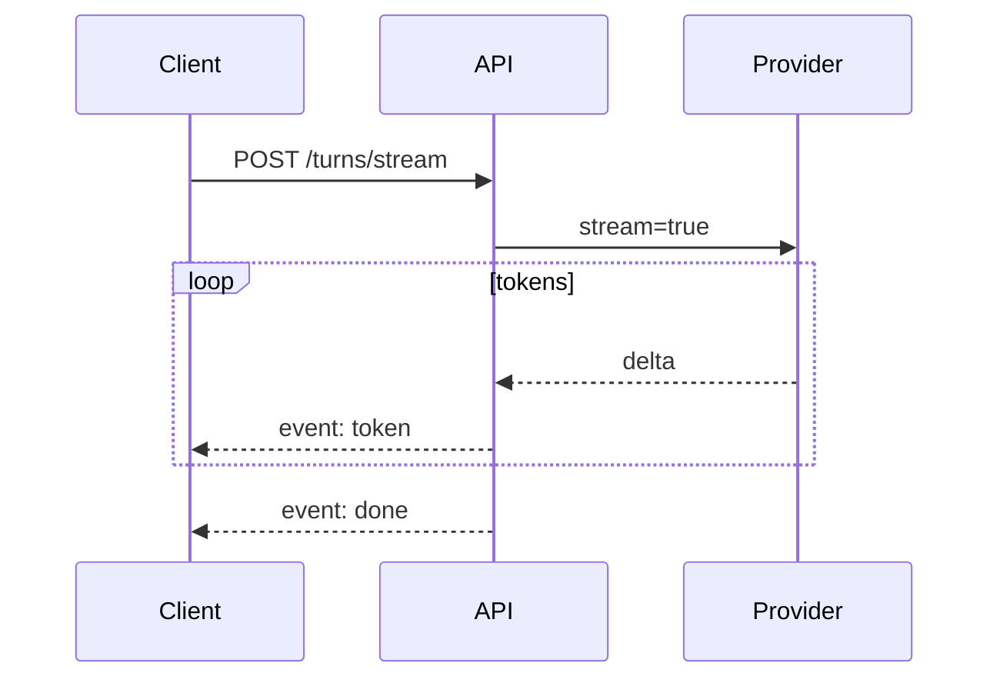

# Streaming and SSE

> SSE streaming turns long generations into responsive UX — design event types, heartbeats, and completion semantics carefully.

## Table of Contents

- [Overview](#overview)
- [Definition](#definition)
- [Why it matters](#why-it-matters)
- [Uses](#uses)
- [How it works](#how-it-works)
- [Worked examples / scenarios](#worked-examples-scenarios)
- [Python Examples](#python-examples)
- [Production Considerations](#production-considerations)
- [Performance Considerations](#performance-considerations)
- [Cost Considerations](#cost-considerations)
- [Security Considerations](#security-considerations)
- [Best Practices](#best-practices)
- [Common Mistakes](#common-mistakes)
- [Interview Preparation](#interview-preparation)
- [Navigation](#navigation)

---

## Overview

Streaming reduces time-to-first-token (TTFT) perception. Server-Sent Events (SSE) are a practical default for browser chat: one-way server push over HTTP.



> **Prerequisites:** [Sync, Async, and Streaming](../../foundations/03-sync-async-streaming.md) · [Chat APIs](01-chat-apis.md)

---

## Definition

**Streaming over SSE** delivers incremental LLM outputs (and tool/progress events) as `text/event-stream` frames so clients can render tokens before the full completion exists.

---

## Why it matters

| Non-streaming | Streaming SSE |
|---------------|---------------|
| Blank wait | Incremental render |
| Simple retries | Need cancel + finalize rules |
| One JSON body | Event protocol |

---

## Uses

| Event | Payload |
|-------|---------|
| `token` | text delta |
| `tool_start` / `tool_end` | tool name, status |
| `error` | code, message |
| `done` | message_id, usage |

---

## How it works

### Framing

Each SSE event has optional `event:` name and `data:` JSON. Send heartbeats as comments (`: ping`) every N seconds.

### Finalization

Always persist the final assistant message server-side when the provider finishes, even if the client disconnected mid-way (product choice — document it).

### Backpressure

If the client is slow, decide whether to buffer or cancel the provider stream.

---

## Worked examples / scenarios

### Proxy idle timeout

Without heartbeats, a 60s thinking gap closes the connection. Fix: `: ping` every 15s + progress events during tools.

### Tool call mid-stream

Emit `tool_start` so the UI shows "Searching docs…", then resume `token` events.

---

## Python Examples

### FastAPI SSE

```python
from fastapi.responses import StreamingResponse
import json

async def event_gen(messages):
    yield f"event: status\ndata: {json.dumps({'phase': 'generating'})}\n\n"
    async for delta in provider.stream(messages):
        yield f"event: token\ndata: {json.dumps({'text': delta})}\n\n"
    yield f"event: done\ndata: {json.dumps({'ok': True})}\n\n"

@app.post("/v1/threads/{tid}/turns/stream")
async def stream_turn(tid: str, body: TurnCreate):
    return StreamingResponse(event_gen(await build(tid, body)), media_type="text/event-stream")
```

### Client fetch reader (browser-oriented sketch)

```javascript
// EventSource is GET-only; for POST use fetch + ReadableStream parser
const res = await fetch(url, { method: "POST", body, headers });
const reader = res.body.getReader();
// parse SSE chunks...
```

---

## Production Considerations

- Standardize event schema across products.
- Load-test concurrent streams per instance.

## Performance Considerations

- Flush early; avoid buffering entire completion.
- Keep event payloads small.

## Cost Considerations

- Cancel provider on client abort when API supports it.
- Do not retry a finished stream blindly.

## Security Considerations

- Auth on stream start; do not put tokens in query strings.
- Apply output filters consistent with policy.

---

## Best Practices

1. Heartbeats.
2. Terminal `done` or `error` always.
3. Correlate events with `message_id`.
4. Document POST+SSE vs EventSource trade-offs.

## Common Mistakes

- No done event
- Buffering all tokens then sending one event
- Forgetting CORS/proxy buffering (`X-Accel-Buffering: no`)
- Leaking tool secrets in events

---

## Interview Preparation

**Q: Why not always use WebSockets for chat?**  
**A:** SSE is enough for server-push tokens, simpler with HTTP infra; use WebSockets when you need rich bidirectional mid-stream control.


---

## Navigation

### This section — APIs and UX

| # | Topic | Document |
|---|-------|----------|
| 1 | Chat APIs | [Chat APIs](01-chat-apis.md) |
| 2 | Streaming and SSE | **You are here** |
| 3 | Tool-Calling UX | [Tool-Calling UX](03-tool-calling-ux.md) |
| 4 | Cancellation and Timeouts | [Cancellation and Timeouts](04-cancellation-and-timeouts.md) |

### Path

- Previous: [Chat APIs](01-chat-apis.md)
- Next: [Tool-Calling UX](03-tool-calling-ux.md)
- Section hub: [APIs and UX](README.md)
- Domain hub: [LLM Application Development](../README.md)

### Related topics

- [Cancellation and Timeouts](04-cancellation-and-timeouts.md)
- [Tool-Calling UX](03-tool-calling-ux.md)

