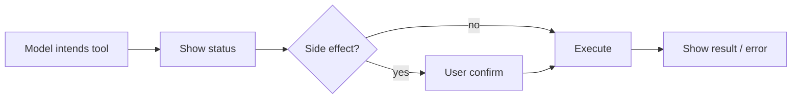
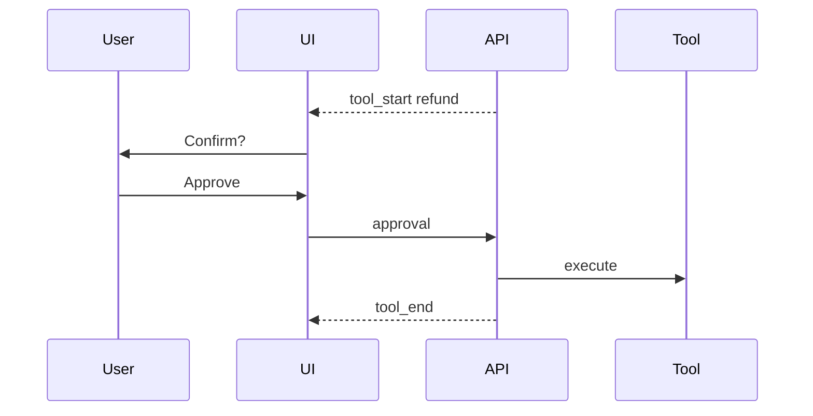

# Tool-Calling UX

> Tool-calling UX must show what the assistant is doing, ask before side effects, and recover gracefully when tools fail.

## Table of Contents

- [Overview](#overview)
- [Definition](#definition)
- [Why it matters](#why-it-matters)
- [Uses](#uses)
- [How it works](#how-it-works)
- [Worked examples / scenarios](#worked-examples-scenarios)
- [Python Examples](#python-examples)
- [Production Considerations](#production-considerations)
- [Performance Considerations](#performance-considerations)
- [Cost Considerations](#cost-considerations)
- [Security Considerations](#security-considerations)
- [Best Practices](#best-practices)
- [Common Mistakes](#common-mistakes)
- [Interview Preparation](#interview-preparation)
- [Navigation](#navigation)

---

## Overview

Users distrust invisible tool use. Good UX surfaces status, arguments (when safe), confirmations for mutations, and clear failures — while streaming continues around tools.



> **Prerequisites:** [Streaming and SSE](02-streaming-and-sse.md) · [Function Calling](../../llm-engineering/function-calling-and-tools.md)

---

## Definition

**Tool-calling UX** is how the product presents, authorizes, and reports LLM-initiated tool invocations — including progress, confirmation, and error states — not only the final natural-language answer.

---

## Why it matters

| Hidden tools | Explicit tool UX |
|--------------|------------------|
| Surprise side effects | Informed consent |
| Opaque latency | Progress clarity |
| Silent failures | Actionable errors |

---

## Uses

| Tool type | UX pattern |
|-----------|------------|
| Read-only search | Inline "Searching…" |
| Create ticket | Confirm card |
| Refund / delete | Strong confirm + reason |
| Multi-tool agent | Step timeline |

---

## How it works

### Event protocol

Emit `tool_start`, `tool_progress`, `tool_end` / `tool_error` on the stream. Persist tool messages for transcript fidelity.

### Confirmation

For mutating tools, interrupt the loop: return a `pending_approval` state to the client; resume on `POST .../approvals`.



---

## Worked examples / scenarios

### Misleading success

Tool fails; model apologizes vaguely. Better: UI shows tool error banner; model gets structured error and proposes next step.

### Parallel tools

Show multiple progress rows; do not assume sequential-only UI.

---

## Python Examples

### Approval gate

```python
MUTATING = {"create_refund", "delete_record"}

async def maybe_execute(tool_name, args, ctx):
    if tool_name in MUTATING and not ctx.approved.get(tool_name):
        return {"status": "pending_approval", "tool": tool_name, "args": redact(args)}
    return await runtime.run(tool_name, args, ctx)
```

### SSE tool events

```python
yield f"event: tool_start\ndata: {json.dumps({'name': name})}\n\n"
result = await runtime.run(name, args)
yield f"event: tool_end\ndata: {json.dumps({'name': name, 'ok': True})}\n\n"
```

---

## Production Considerations

- Catalog tools with UX metadata (mutating?, confirm_copy).
- Audit log approvals.

## Performance Considerations

- Parallelize read-only tools.
- Timeouts per tool surfaced to UI.

## Cost Considerations

- Failed tools still cost model tokens — surface that in analytics.

## Security Considerations

- Never display secrets in tool args UI.
- Server-side enforce allowlist regardless of UI.

---

## Best Practices

1. Classify tools by risk.
2. Structured errors to the model and the UI.
3. Keep transcripts faithful (tool messages).
4. Accessibility: status text, not only spinners.

## Common Mistakes

- Auto-running refunds
- Empty UI during 10s tool calls
- Showing raw stack traces to users
- Letting the model invent tool names in the UI

---

## Interview Preparation

**Q: Where should tool confirmation live — UI only or server?**  
**A:** Server must enforce; UI provides the affordance. Never rely on the client alone.


---

## Navigation

### This section — APIs and UX

| # | Topic | Document |
|---|-------|----------|
| 1 | Chat APIs | [Chat APIs](01-chat-apis.md) |
| 2 | Streaming and SSE | [Streaming and SSE](02-streaming-and-sse.md) |
| 3 | Tool-Calling UX | **You are here** |
| 4 | Cancellation and Timeouts | [Cancellation and Timeouts](04-cancellation-and-timeouts.md) |

### Path

- Previous: [Streaming and SSE](02-streaming-and-sse.md)
- Next: [Cancellation and Timeouts](04-cancellation-and-timeouts.md)
- Section hub: [APIs and UX](README.md)
- Domain hub: [LLM Application Development](../README.md)

### Related topics

- [Orchestration Patterns](../orchestration/01-orchestration-patterns.md)
- [Function Calling and Tools](../../llm-engineering/function-calling-and-tools.md)

