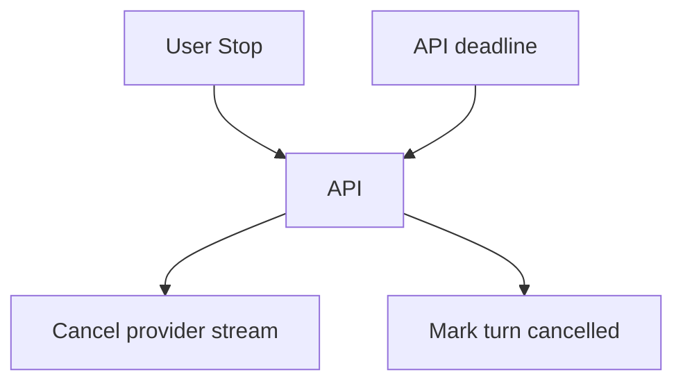
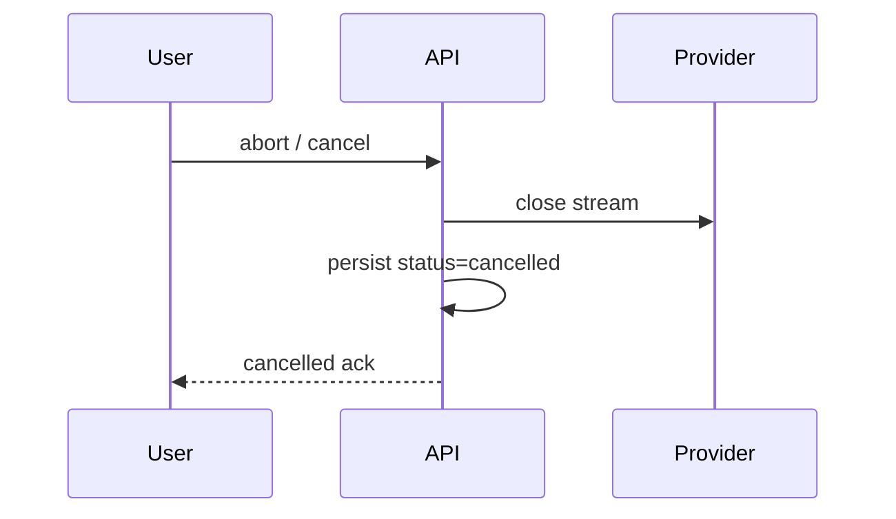

# Cancellation and Timeouts

> Cancellation and timeouts are UX and cost controls — wire them from browser abort through your API to the provider.

## Table of Contents

- [Overview](#overview)
- [Definition](#definition)
- [Why it matters](#why-it-matters)
- [Uses](#uses)
- [How it works](#how-it-works)
- [Worked examples / scenarios](#worked-examples-scenarios)
- [Python Examples](#python-examples)
- [Production Considerations](#production-considerations)
- [Performance Considerations](#performance-considerations)
- [Cost Considerations](#cost-considerations)
- [Security Considerations](#security-considerations)
- [Best Practices](#best-practices)
- [Common Mistakes](#common-mistakes)
- [Interview Preparation](#interview-preparation)
- [Navigation](#navigation)

---

## Overview

Users hit Stop. Gateways kill idle connections. Workers exceed budgets. Without coordinated cancellation, you pay for orphaned generations and leave threads half-written.



> **Prerequisites:** [Streaming and SSE](02-streaming-and-sse.md) · [Retries and Timeouts](../reliability/01-retries-and-timeouts.md)

---

## Definition

**Cancellation** aborts in-flight LLM work in response to client or system signals. **Timeouts** are deadlines at each hop (client, API, tool, provider) that trigger cancellation and typed errors.

---

## Why it matters

| Missing cancel | Consequence |
|----------------|-------------|
| Provider continues | Wasted $ |
| No UI stop | Frustrated users |
| No deadline | Stuck workers |

---

## Uses

| Layer | Mechanism |
|-------|-----------|
| Browser | `AbortController` |
| API | request disconnect / cancel endpoint |
| Python | `asyncio.CancelledError` / httpx timeout |
| Provider | stream close / cancel API when available |

---

## How it works

### Deadline propagation

Compute an absolute deadline at ingress; pass remaining budget downstream.

### Cooperative cancellation

Between tool calls, check a cancel flag / event so agent loops stop promptly.



---

## Worked examples / scenarios

### Stop button

UI aborts fetch; API detects disconnect, closes provider stream, saves partial text optionally as `cancelled` message.

### Tool longer than budget

Tool timeout fires; orchestrator records tool error and either stops or continues per policy.

---

## Python Examples

### httpx timeout + cancel

```python
import httpx

timeout = httpx.Timeout(connect=5.0, read=60.0, write=10.0, pool=5.0)

async with httpx.AsyncClient(timeout=timeout) as client:
    async with client.stream("POST", url, json=payload) as resp:
        async for chunk in resp.aiter_bytes():
            if ctx.cancelled:
                await resp.aclose()
                raise asyncio.CancelledError()
            yield chunk
```

### FastAPI disconnect

```python
@app.post("/v1/stream")
async def stream(request: Request):
    async def gen():
        async for tok in provider.stream(...):
            if await request.is_disconnected():
                await provider.abort()
                break
            yield format_sse(tok)
    return StreamingResponse(gen(), media_type="text/event-stream")
```

---

## Production Considerations

- Define whether partial tokens are persisted.
- Metrics: cancel rate, orphaned provider calls.

## Performance Considerations

- Check cancel between tools, not only on token boundaries.
- Bound queue wait separately from run timeout.

## Cost Considerations

- Track cancelled-but-billed tokens.
- Prefer providers with cancel support.

## Security Considerations

- Authorize cancel to thread members only.
- Cancel tokens should not be guessable IDs alone without auth.

---

## Best Practices

1. Absolute deadlines at the edge.
2. Typed timeout errors to clients.
3. Idempotent cancel endpoints.
4. Test disconnect paths.

## Common Mistakes

- Only client-side timeout with server still running
- Ignoring CancelledError and continuing tools
- Infinite client spinner with no server deadline
- Treating cancel as empty 200 OK without status

---

## Interview Preparation

**Q: How do you implement a Stop button end-to-end?**  
**A:** Client aborts the stream; API detects disconnect or explicit cancel; cooperative checks stop the orchestrator; provider stream is closed; turn marked cancelled; usage recorded.


---

## Navigation

### This section — APIs and UX

| # | Topic | Document |
|---|-------|----------|
| 1 | Chat APIs | [Chat APIs](01-chat-apis.md) |
| 2 | Streaming and SSE | [Streaming and SSE](02-streaming-and-sse.md) |
| 3 | Tool-Calling UX | [Tool-Calling UX](03-tool-calling-ux.md) |
| 4 | Cancellation and Timeouts | **You are here** |

### Path

- Previous: [Tool-Calling UX](03-tool-calling-ux.md)
- Next: [Retries and Timeouts](../reliability/01-retries-and-timeouts.md)
- Section hub: [APIs and UX](README.md)
- Domain hub: [LLM Application Development](../README.md)

### Related topics

- [Retries and Timeouts](../reliability/01-retries-and-timeouts.md)
- [Sync, Async, and Streaming](../../foundations/03-sync-async-streaming.md)

