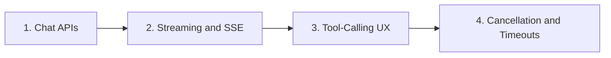

# APIs and UX

> Chat APIs, SSE streaming, tool-calling UX, and cancellation/timeouts.

**Parent:** [LLM Application Development](../README.md)

---

## Topics

| # | Topic | Document |
|---|-------|----------|
| 1 | Chat APIs | [01-chat-apis.md](01-chat-apis.md) |
| 2 | Streaming and SSE | [02-streaming-and-sse.md](02-streaming-and-sse.md) |
| 3 | Tool-Calling UX | [03-tool-calling-ux.md](03-tool-calling-ux.md) |
| 4 | Cancellation and Timeouts | [04-cancellation-and-timeouts.md](04-cancellation-and-timeouts.md) |

---

## Learning path

