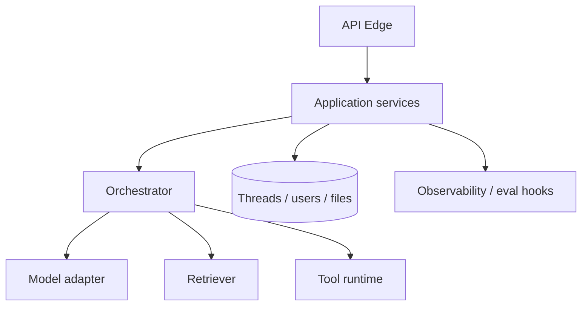
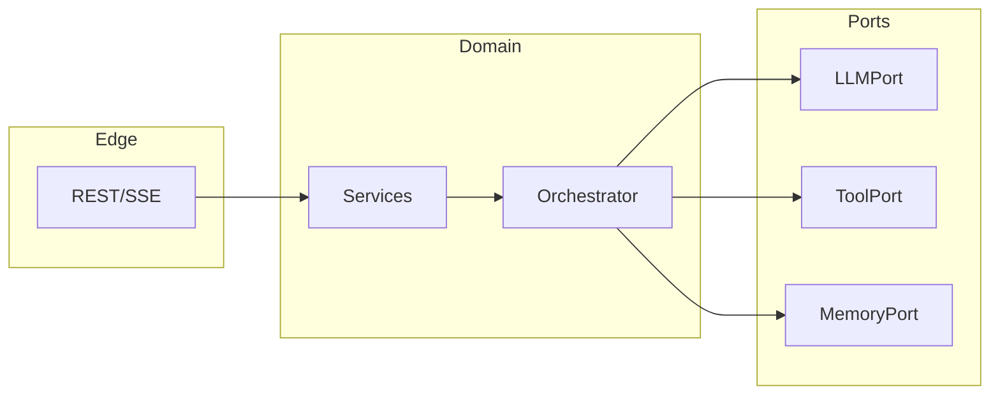

# LLM App Architecture

> A reference architecture for LLM-backed services — clear layers so you can swap models, add RAG, or introduce agents without rewriting the product.

## Table of Contents

- [Overview](#overview)
- [Definition](#definition)
- [Why it matters](#why-it-matters)
- [Uses](#uses)
- [How it works](#how-it-works)
- [Worked examples / scenarios](#worked-examples-scenarios)
- [Python Examples](#python-examples)
- [Production Considerations](#production-considerations)
- [Performance Considerations](#performance-considerations)
- [Cost Considerations](#cost-considerations)
- [Security Considerations](#security-considerations)
- [Best Practices](#best-practices)
- [Common Mistakes](#common-mistakes)
- [Interview Preparation](#interview-preparation)
- [Navigation](#navigation)

---

## Overview

Early LLM demos collapse API handlers, prompts, vendor SDKs, and DB writes into one file. That works until you need a second model, a second tenant, or an eval harness.

This lesson expands the reference architecture: edges, services, orchestrators, adapters, stores, and hooks — the skeleton every later section hangs on.



> **Prerequisites:** [Foundations](../../foundations/README.md) · [Backend Engineering](../../backend-engineering/README.md)

---

## Definition

An **LLM app architecture** is a layered design where product APIs and domain services orchestrate prompts, retrieval, and tools through **provider adapters**, with explicit persistence and observability — treating the model as a dependency, not the application.

---

## Why it matters

| Without clear architecture | With reference layers |
|----------------------------|----------------------|
| Vendor lock-in in handlers | Swap adapters behind interfaces |
| Untestable prompt strings | Pure prompt builders |
| Hidden state in model memory | Explicit thread/job stores |
| Blind production | Traces, usage, eval hooks |

---

## Uses

| Application | Architecture focus |
|-------------|-------------------|
| Chat API | Thread store + streaming edge + orchestrator |
| Doc QA | Retriever + cite-and-generate path |
| Workflow apps | Deterministic DAG + LLM steps at nodes |
| Multi-tenant SaaS | Tenant context through every layer |

---

## How it works

### Core layers

1. **API edge** — HTTP/SSE, auth, rate limits, request IDs.
2. **Application services** — use-cases (start thread, run turn, create job).
3. **Orchestrator** — control flow across model, tools, retrieval.
4. **Provider adapters** — normalize OpenAI/Anthropic/local/gateway APIs.
5. **Tool runtime** — allowlisted functions with authz and timeouts.
6. **Persistence** — threads, messages, files, memories, usage.
7. **Observability** — traces, metrics, eval sampling.



### Key principles

1. **Provider adapters** — Isolate vendor SDKs behind interfaces.
2. **Pure prompt builders** — Testable functions, not buried strings.
3. **Explicit state** — Do not hide critical state only inside the model.
4. **Policy outside the model** — AuthZ, quotas, and invariants in code.

---

## Worked examples / scenarios

### Scenario — Adding RAG without rewrite

Because retrieval sits behind a port, you add a `Retriever` implementation and an orchestrator path `retrieve → generate` without touching the chat HTTP schema.

### Scenario — Dual-vendor failover

`LLMPort.complete()` tries primary adapter; on `ProviderUnavailable`, secondary adapter. Services stay unaware of vendors.

### Scenario — Eval harness

The same orchestrator runs offline against golden sets by injecting a fake `LLMPort` — architecture that cannot be tested offline is unfinished.

---

## Python Examples

### Port + adapter

```python
from typing import Protocol

class LLMPort(Protocol):
    async def complete(self, messages: list[dict], **kw) -> "Completion": ...

class OpenAIAdapter:
    def __init__(self, client): self.client = client
    async def complete(self, messages, **kw):
        resp = await self.client.chat.completions.create(
            model=kw.get("model", "gpt-4o-mini"),
            messages=messages,
            temperature=kw.get("temperature", 0),
        )
        return Completion(text=resp.choices[0].message.content, usage=resp.usage)
```

### Service using orchestrator

```python
class ChatService:
    def __init__(self, orch, threads, usage):
        self.orch, self.threads, self.usage = orch, threads, usage

    async def turn(self, tenant_id: str, thread_id: str, message: str):
        history = await self.threads.load(thread_id)
        result = await self.orch.run_turn(history, message)
        await self.threads.append(thread_id, "user", message)
        await self.threads.append(thread_id, "assistant", result.text)
        await self.usage.record(tenant_id, result.usage)
        return result
```

---

## Production Considerations

- Version your architecture decisions (ADR): streaming protocol, idempotency, tool authz.
- Keep OpenAPI aligned with service contracts, not with raw provider payloads.

## Performance Considerations

- Cache embeddings/retrieval independently from generation.
- Connection-pool provider HTTP clients per process.

## Cost Considerations

- Centralize model selection in config/flags, not scattered string literals.
- Emit per-tenant usage from one place (the adapter or a decorator).

## Security Considerations

- Never pass raw provider API keys to the browser.
- Tool runtime must enforce tenant-scoped credentials.

---

## Best Practices

1. Draw the diagram before adding an agent framework.
2. One orchestrator API used by HTTP and workers.
3. Prefer ports/adapters over framework lock-in.
4. Put business invariants in code, not only prompts.

## Common Mistakes

- God-object 'agent' with no boundaries
- Business rules only inside prompts
- Vendor SDK types leaking into REST schemas
- No persistence for threads/jobs

---

## Interview Preparation

**Q: What is a provider adapter and why use one?**  
**A:** A thin interface over vendor SDKs so the app can switch models, add failover, and mock LLM calls in tests without rewriting product code.

**Q: Where should prompt templates live?**  
**A:** In pure, versioned builders/modules — not inline in route handlers — so they can be unit-tested and reviewed like code.


---

## Navigation

### This section — Architecture

| # | Topic | Document |
|---|-------|----------|
| 1 | LLM App Architecture | **You are here** |
| 2 | Layers and Boundaries | [Layers and Boundaries](02-layers-and-boundaries.md) |
| 3 | Provider Adapters and Gateways | [Provider Adapters and Gateways](03-provider-adapters-and-gateways.md) |
| 4 | Multi-Tenant LLM Apps | [Multi-Tenant LLM Apps](04-multi-tenant-llm-apps.md) |

### Path

- Previous: [Sync, Async, and Streaming](../../foundations/03-sync-async-streaming.md)
- Next: [Layers and Boundaries](02-layers-and-boundaries.md)
- Section hub: [Architecture](README.md)
- Domain hub: [LLM Application Development](../README.md)

### Related topics

- [AI System Design](../../ai-system-design/README.md)
- [Layers and Boundaries](02-layers-and-boundaries.md)
- [Orchestration Patterns](../orchestration/01-orchestration-patterns.md)

