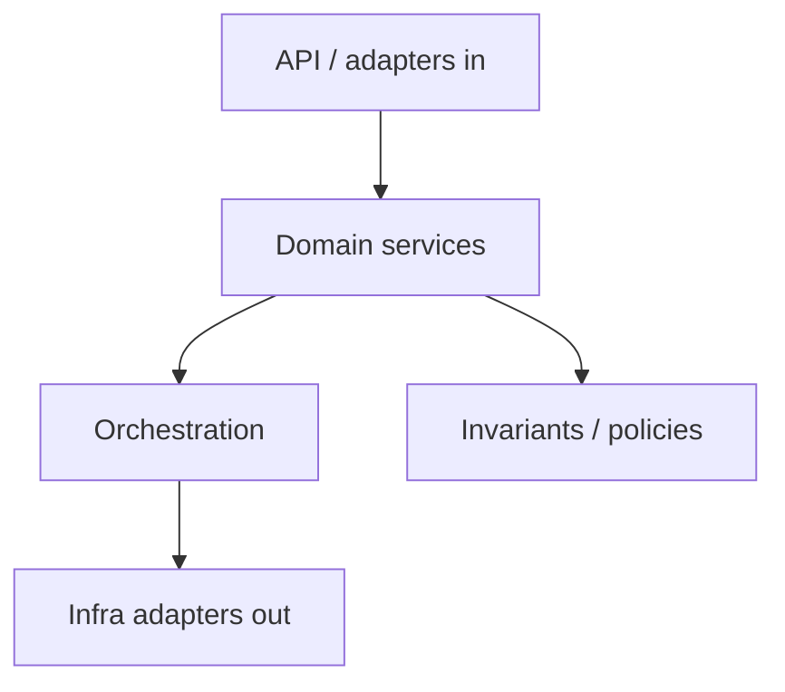
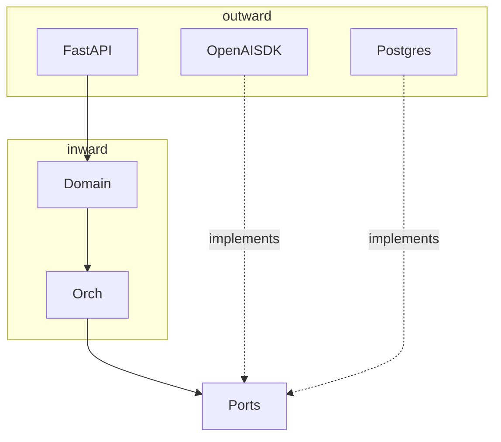

# Layers and Boundaries

> Draw hard boundaries between HTTP, domain logic, orchestration, tools, and infra — LLM apps rot when those layers collapse.

## Table of Contents

- [Overview](#overview)
- [Definition](#definition)
- [Why it matters](#why-it-matters)
- [Uses](#uses)
- [How it works](#how-it-works)
- [Worked examples / scenarios](#worked-examples-scenarios)
- [Python Examples](#python-examples)
- [Production Considerations](#production-considerations)
- [Performance Considerations](#performance-considerations)
- [Cost Considerations](#cost-considerations)
- [Security Considerations](#security-considerations)
- [Best Practices](#best-practices)
- [Common Mistakes](#common-mistakes)
- [Interview Preparation](#interview-preparation)
- [Navigation](#navigation)

---

## Overview

Layering is not ceremony. It is how you keep prompt changes from breaking auth, and tool changes from breaking billing.



> **Prerequisites:** [LLM App Architecture](01-llm-app-architecture.md)

---

## Definition

**Layers and boundaries** in an LLM app separate *delivery* (HTTP/SSE), *domain* (product rules), *orchestration* (model/tool control flow), and *infrastructure* (vendors, DB, queues) so each can change with minimal blast radius.

---

## Why it matters

| Boundary leak | Symptom |
|---------------|---------|
| Provider types in API | Clients break on vendor change |
| DB queries in orchestrator | Untestable loops |
| AuthZ only in UI | Tool exploit via API |
| Prompts in route handlers | Impossible review/eval |

---

## Uses

| Boundary | Owns |
|----------|------|
| API | DTOs, authn wiring, status codes, SSE framing |
| Domain | Entitlements, thread rules, billing events |
| Orchestration | Step order, retries policy application, tool loop |
| Infra | SQL, Redis, OpenAI SDK, S3 |

---

## How it works

### Dependency rule

Inner layers must not import outer frameworks. Domain should not import FastAPI or OpenAI. Orchestrator depends on ports; infra implements ports.



### What stays out of prompts

- Authorization decisions
- Numeric billing rules
- "Must never delete production" invariants

Encode those in domain/policy modules; mention them in prompts only as UX guidance, not as the sole enforcement.

---

## Worked examples / scenarios

### Refactor smell — `chat.py` 2k lines

Split into `routes/chat.py`, `services/chat_service.py`, `orch/turn_orchestrator.py`, `adapters/openai_llm.py`, `repos/threads.py`.

### Adding MCP tools

Tool runtime is an infra adapter; domain only sees `ToolPort.execute(name, args, ctx)` with authz already applied.

---

## Python Examples

### Domain policy vs prompt

```python
def assert_can_call_tool(user: User, tool: str) -> None:
    if tool == "refund_charge" and "finance_admin" not in user.roles:
        raise PermissionError("refund_charge denied")

async def execute_tool(user, tool, args):
    assert_can_call_tool(user, tool)  # code enforcement
    return await tool_runtime.run(tool, args)
```

### DTO boundary

```python
class ChatTurnRequest(BaseModel):
    thread_id: str
    message: str = Field(max_length=8_000)

# map to domain command — do not pass Request into orchestrator
@dataclass
class RunTurn:
    tenant_id: str
    thread_id: str
    message: str
    request_id: str
```

---

## Production Considerations

- Enforce boundaries in code review checklists.
- Archunit-style import linters help in large repos.

## Performance Considerations

- Boundaries should not mean unnecessary network hops; prefer in-process ports first.

## Cost Considerations

- Keep usage accounting at the adapter boundary so every call is metered once.

## Security Considerations

- AuthZ checks belong in domain/tool runtime, not only in the LLM prompt.

---

## Best Practices

1. Pass commands/DTOs inward, not framework objects.
2. One module owns prompt templates.
3. Orchestrator returns domain results; API maps to HTTP.
4. Write unit tests for domain without network.

## Common Mistakes

- Passing `Request` into orchestrator
- Importing OpenAI types in Pydantic response models
- Trusting the model to refuse unauthorized tools
- Circular imports across layers

---

## Interview Preparation

**Q: Why not put AuthZ instructions only in the system prompt?**  
**A:** Models can be manipulated or simply fail; authorization must be enforced in trusted code before side effects.


---

## Navigation

### This section — Architecture

| # | Topic | Document |
|---|-------|----------|
| 1 | LLM App Architecture | [LLM App Architecture](01-llm-app-architecture.md) |
| 2 | Layers and Boundaries | **You are here** |
| 3 | Provider Adapters and Gateways | [Provider Adapters and Gateways](03-provider-adapters-and-gateways.md) |
| 4 | Multi-Tenant LLM Apps | [Multi-Tenant LLM Apps](04-multi-tenant-llm-apps.md) |

### Path

- Previous: [LLM App Architecture](01-llm-app-architecture.md)
- Next: [Provider Adapters and Gateways](03-provider-adapters-and-gateways.md)
- Section hub: [Architecture](README.md)
- Domain hub: [LLM Application Development](../README.md)

### Related topics

- [LLM App Architecture](01-llm-app-architecture.md)
- [Provider Adapters and Gateways](03-provider-adapters-and-gateways.md)

