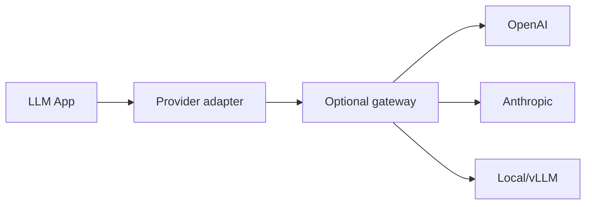
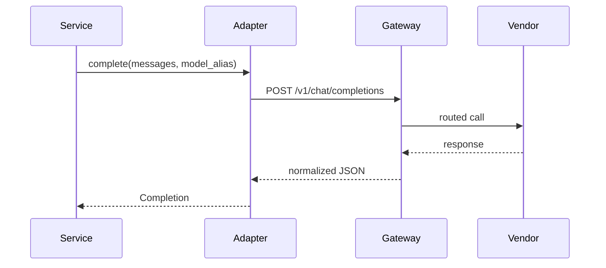

# Provider Adapters and Gateways

> Wrap vendors in adapters — and optionally an LLM gateway — so routing, retries, and policy stay under your control.

## Table of Contents

- [Overview](#overview)
- [Definition](#definition)
- [Why it matters](#why-it-matters)
- [Uses](#uses)
- [How it works](#how-it-works)
- [Worked examples / scenarios](#worked-examples-scenarios)
- [Python Examples](#python-examples)
- [Production Considerations](#production-considerations)
- [Performance Considerations](#performance-considerations)
- [Cost Considerations](#cost-considerations)
- [Security Considerations](#security-considerations)
- [Best Practices](#best-practices)
- [Common Mistakes](#common-mistakes)
- [Interview Preparation](#interview-preparation)
- [Navigation](#navigation)

---

## Overview

Raw SDK calls in business logic create lock-in and inconsistent retries. Adapters normalize interfaces; gateways centralize cross-cutting concerns for many services.



> **Prerequisites:** [Layers and Boundaries](02-layers-and-boundaries.md)

---

## Definition

A **provider adapter** translates your app's `LLMPort` into a vendor SDK. An **LLM gateway** is a shared proxy that adds routing, auth, rate limits, caching, and observability across many callers.

---

## Why it matters

| Concern | Adapter | Gateway |
|---------|---------|---------|
| Per-app interface | Yes | Optional |
| Org-wide rate limits | Hard | Natural fit |
| Central guardrails | Possible | Strong fit |
| Local unit tests | Mock adapter | Harder |

---

## Uses

| Pattern | When |
|---------|------|
| In-process adapter only | Single service, simple fleet |
| Adapter + gateway | Many services, shared keys, org policy |
| Gateway-only (HTTP) | Polyglot clients; still keep a thin client adapter |

---

## How it works

### Adapter responsibilities

- Map messages/tools to vendor schema
- Normalize usage and finish reasons
- Apply timeouts and error taxonomy (`RateLimited`, `Unavailable`, `InvalidRequest`)
- Redact secrets before logging

### Gateway responsibilities

- API key custody and per-tenant virtual keys
- Model routing / aliases (`chat-strong` → concrete model)
- Cache for identical deterministic requests
- Global concurrency caps



---

## Worked examples / scenarios

### Alias routing

Product asks for `model="support-draft"`. Gateway maps alias → `gpt-4o-mini` in staging and a larger model in prod via config — no app redeploy for model bumps when alias is stable.

### Outage failover

Primary 503 → gateway retries secondary provider with translated messages (within capability limits).

---

## Python Examples

### Error taxonomy

```python
class LLMError(Exception): ...
class RateLimited(LLMError): ...
class ProviderUnavailable(LLMError): ...
class InvalidRequest(LLMError): ...

def map_openai_error(exc: Exception) -> LLMError:
    status = getattr(exc, "status_code", None)
    if status == 429:
        return RateLimited(str(exc))
    if status in (500, 502, 503):
        return ProviderUnavailable(str(exc))
    return InvalidRequest(str(exc))
```

### Thin HTTP gateway client

```python
import httpx

class GatewayLLM:
    def __init__(self, base_url: str, api_key: str):
        self.client = httpx.AsyncClient(base_url=base_url, headers={"Authorization": f"Bearer {api_key}"}, timeout=60)

    async def complete(self, messages, model="chat-strong"):
        r = await self.client.post("/v1/chat/completions", json={"model": model, "messages": messages})
        r.raise_for_status()
        data = r.json()
        return data["choices"][0]["message"]["content"]
```

---

## Production Considerations

- Own an error taxonomy shared by reliability policies.
- Version gateway APIs; treat aliases as contracts.

## Performance Considerations

- Enable HTTP/2 to providers where available.
- Connection pooling at adapter/gateway.

## Cost Considerations

- Cache only when temperature=0 and inputs identical.
- Tag spend by alias + tenant at the gateway.

## Security Considerations

- Prefer gateway-held keys over distributing vendor keys to every microservice.
- Audit model access by tenant.

---

## Best Practices

1. Normalize finish reasons and tool call shapes.
2. Keep streaming and non-streaming parity in the adapter.
3. Contract-test adapters against recorded fixtures.
4. Document capability gaps across vendors.

## Common Mistakes

- Catching all exceptions and retrying invalid requests
- Logging full prompts at the gateway without redaction
- Hardcoding model IDs in 20 services
- Assuming all vendors support the same tool schema

---

## Interview Preparation

**Q: Adapter vs gateway — do you need both?**  
**A:** Adapters are almost always worth it for testability. Gateways pay off at org scale for key management, routing, and centralized policy.


---

## Navigation

### This section — Architecture

| # | Topic | Document |
|---|-------|----------|
| 1 | LLM App Architecture | [LLM App Architecture](01-llm-app-architecture.md) |
| 2 | Layers and Boundaries | [Layers and Boundaries](02-layers-and-boundaries.md) |
| 3 | Provider Adapters and Gateways | **You are here** |
| 4 | Multi-Tenant LLM Apps | [Multi-Tenant LLM Apps](04-multi-tenant-llm-apps.md) |

### Path

- Previous: [Layers and Boundaries](02-layers-and-boundaries.md)
- Next: [Multi-Tenant LLM Apps](04-multi-tenant-llm-apps.md)
- Section hub: [Architecture](README.md)
- Domain hub: [LLM Application Development](../README.md)

### Related topics

- [Fallbacks and Circuit Breakers](../reliability/03-fallbacks-and-circuit-breakers.md)
- [AI Deployment](../../ai-deployment/README.md)

