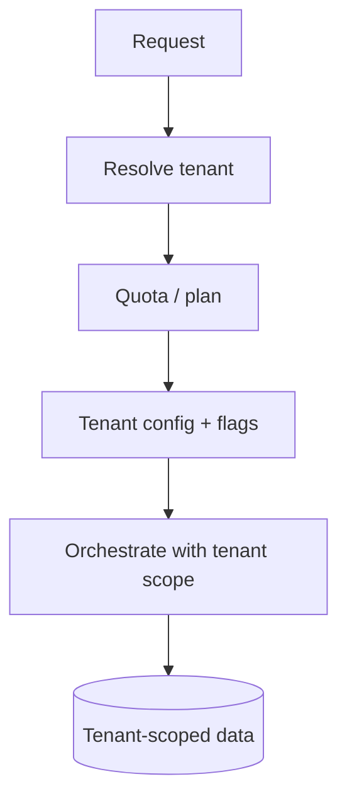
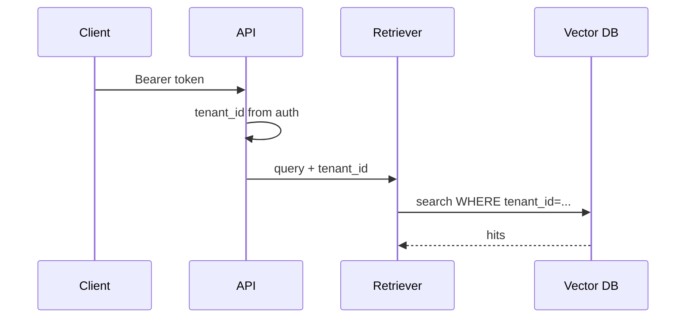

# Multi-Tenant LLM Apps

> Multi-tenant LLM apps need isolation for data, prompts, keys, quotas, and traces — one missing filter is a breach.

## Table of Contents

- [Overview](#overview)
- [Definition](#definition)
- [Why it matters](#why-it-matters)
- [Uses](#uses)
- [How it works](#how-it-works)
- [Worked examples / scenarios](#worked-examples-scenarios)
- [Python Examples](#python-examples)
- [Production Considerations](#production-considerations)
- [Performance Considerations](#performance-considerations)
- [Cost Considerations](#cost-considerations)
- [Security Considerations](#security-considerations)
- [Best Practices](#best-practices)
- [Common Mistakes](#common-mistakes)
- [Interview Preparation](#interview-preparation)
- [Navigation](#navigation)

---

## Overview

SaaS LLM products share compute but must never share customer context by accident. Tenancy touches every layer: auth, retrieval filters, tool credentials, rate limits, and billing.



> **Prerequisites:** [LLM App Architecture](01-llm-app-architecture.md)

---

## Definition

A **multi-tenant LLM app** serves many customers from one deployment while enforcing **tenant isolation** for data, configuration, secrets, usage quotas, and observability.

---

## Why it matters

| Risk | Example |
|------|---------|
| Data leak | RAG without `tenant_id` filter |
| Noisy neighbor | One tenant exhausts RPM |
| Config bleed | Tenant A sees Tenant B prompt experiment |
| Key confusion | Shared tool OAuth token across tenants |

---

## Uses

| Tenancy model | Notes |
|---------------|-------|
| Pool (shared DB, row filters) | Common SaaS; strict query discipline |
| Silo (per-tenant DB/schema) | Higher isolation, more ops |
| Hybrid | Sensitive data siloed; chat meta pooled |

---

## How it works

### Tenant context object

Carry `tenant_id` (and optional `workspace_id`) explicitly through services — do not rely on ambient globals without care.



### Quotas

Enforce RPM, TPM, daily $, and max context size per plan before calling providers.

---

## Worked examples / scenarios

### Vector leak regression

Engineer adds a debug "search all" path without tenant filter. Mitigation: integration test that inserts two tenants' docs and asserts zero cross hits; code review checklist item.

### Custom model per enterprise

Tenant config selects `model_alias` and optional BYOK via gateway virtual keys.

---

## Python Examples

### Tenant-scoped retrieval

```python
async def retrieve(tenant_id: str, query: str, k: int = 5):
    assert tenant_id, "tenant_id required"
    return await vector_db.search(
        collection="docs",
        query=query,
        filters={"tenant_id": tenant_id},
        k=k,
    )
```

### Quota check

```python
async def check_quota(tenant_id: str, est_tokens: int) -> None:
    plan = await plans.get(tenant_id)
    used = await usage.tpm(tenant_id)
    if used + est_tokens > plan.tpm_limit:
        raise HTTPException(429, "token quota exceeded")
```

---

## Production Considerations

- Make `tenant_id` required in repository method signatures.
- Separate billing accounts from auth tenants carefully (resellers).

## Performance Considerations

- Per-tenant concurrency limits protect shared worker pools.
- Cache tenant config with short TTL.

## Cost Considerations

- Attribute every provider call to tenant + feature flag.
- Soft and hard limits; notify before hard cutoffs.

## Security Considerations

- Test isolation continuously.
- Redact tenant data in shared logs; partition traces by tenant attribute.

---

## Best Practices

1. Thread tenant context via typed `TenantContext`.
2. Default-deny on data access.
3. Per-tenant encryption keys when contracts require.
4. Load-test noisy-neighbor scenarios.

## Common Mistakes

- Global vector search without filters
- Shared tool credentials across tenants
- Logging prompts from all tenants to one unscoped bucket
- Quotas only on the edge, not on workers

---

## Interview Preparation

**Q: How do you prevent cross-tenant RAG leakage?**  
**A:** Mandatory tenant filters at the retrieval API, defense-in-depth in the vector index metadata, and automated tests that fail the build if cross-tenant hits appear.


---

## Navigation

### This section — Architecture

| # | Topic | Document |
|---|-------|----------|
| 1 | LLM App Architecture | [LLM App Architecture](01-llm-app-architecture.md) |
| 2 | Layers and Boundaries | [Layers and Boundaries](02-layers-and-boundaries.md) |
| 3 | Provider Adapters and Gateways | [Provider Adapters and Gateways](03-provider-adapters-and-gateways.md) |
| 4 | Multi-Tenant LLM Apps | **You are here** |

### Path

- Previous: [Provider Adapters and Gateways](03-provider-adapters-and-gateways.md)
- Next: [Orchestration Patterns](../orchestration/01-orchestration-patterns.md)
- Section hub: [Architecture](README.md)
- Domain hub: [LLM Application Development](../README.md)

### Related topics

- [Config and Feature Flags](../production/02-config-and-feature-flags.md)
- [Idempotency and Dedup](../reliability/02-idempotency-and-dedup.md)

