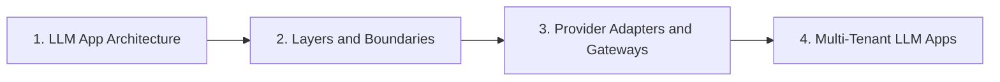

# Architecture

> Reference architecture, layer boundaries, provider adapters, and multi-tenant LLM apps.

**Parent:** [LLM Application Development](../README.md)

---

## Topics

| # | Topic | Document |
|---|-------|----------|
| 1 | LLM App Architecture | [01-llm-app-architecture.md](01-llm-app-architecture.md) |
| 2 | Layers and Boundaries | [02-layers-and-boundaries.md](02-layers-and-boundaries.md) |
| 3 | Provider Adapters and Gateways | [03-provider-adapters-and-gateways.md](03-provider-adapters-and-gateways.md) |
| 4 | Multi-Tenant LLM Apps | [04-multi-tenant-llm-apps.md](04-multi-tenant-llm-apps.md) |

---

## Learning path

