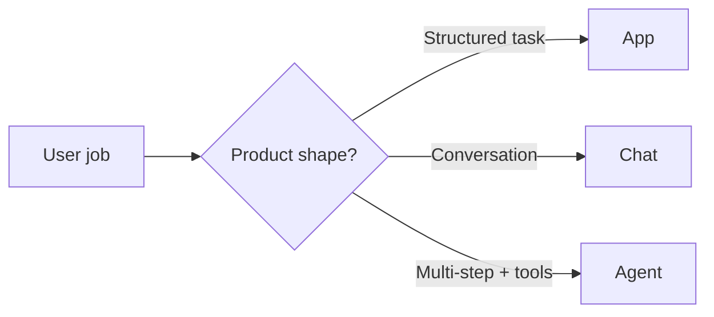
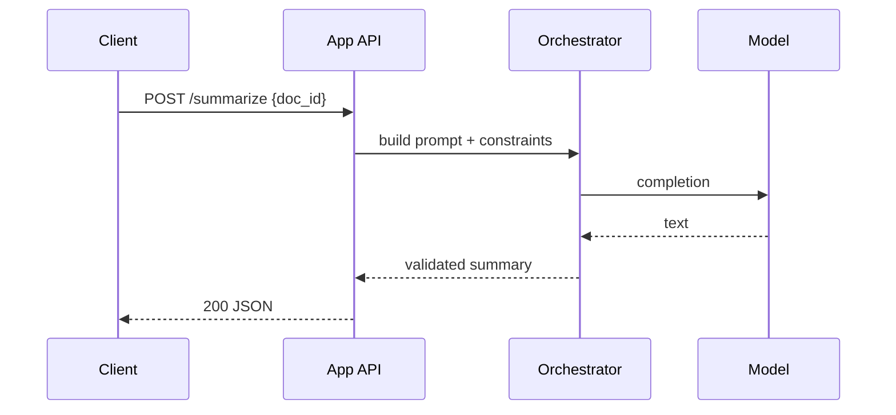

# App vs Chat vs Agent

> Choose the simplest product shape that meets the job: app, chat, or agent — then design APIs and orchestration around that choice.

## Table of Contents

- [Overview](#overview)
- [Definition](#definition)
- [Why it matters](#why-it-matters)
- [Uses](#uses)
- [How it works](#how-it-works)
- [Worked examples / scenarios](#worked-examples-scenarios)
- [Python Examples](#python-examples)
- [Production Considerations](#production-considerations)
- [Performance Considerations](#performance-considerations)
- [Cost Considerations](#cost-considerations)
- [Security Considerations](#security-considerations)
- [Best Practices](#best-practices)
- [Common Mistakes](#common-mistakes)
- [Interview Preparation](#interview-preparation)
- [Navigation](#navigation)

---

## Overview

Teams often say "we're building an agent" when they mean "we call GPT from a form." That ambiguity drives overbuilt orchestration, fuzzy SLAs, and UI that cannot explain what the system is doing.

This lesson draws hard boundaries between three common shapes so you can pick architecture, UX, and evaluation criteria deliberately.



> **Prerequisites:** [Prompt Engineering](../../prompt-engineering/README.md) · [Large Language Models](../../llm-engineering/README.md)

---

## Definition

An **LLM product shape** is the interaction and control model of your system: a focused **app** (one job, structured I/O), a **chat** product (threaded conversation), or an **agent** (plan + tools + loops with budgets).

---

## Why it matters

| Stakeholder | Care-about |
|-------------|------------|
| Product | Clear UX promises ("answer in one shot" vs "I'll take a few steps") |
| Engineering | Latency budgets, state model, tool authz |
| Ops / SRE | Failure modes and cost envelopes |
| Legal / Safety | Autonomy boundaries and human-in-the-loop |

Wrong shape → wrong reliability story. Agents need step budgets and tool allowlists; chat needs thread persistence and streaming; apps need schemas and idempotent APIs.

---

## Uses

| Shape | Best for | Avoid when |
|-------|----------|------------|
| **App** | Classification, extraction, rewrite, summarization APIs | User must negotiate intent over many turns |
| **Chat** | Support, tutoring, copilots with memory of the thread | Task is a single form submit with a schema |
| **Agent** | Research, ops assistants, multi-tool workflows | A RAG chain or deterministic pipeline would suffice |

---

## How it works

### App (single-purpose LLM feature)

An **app** exposes a contract: typed input → typed (or validated) output. The model is a step inside a service method. State lives in your DB; conversation history is optional or absent.



### Chat (threaded conversation)

A **chat** product persists messages in a thread, streams tokens, and may call tools — but the primary loop is *user turn → assistant turn*. Autonomy is bounded by the turn.

### Agent (goal + tools + control loop)

An **agent** repeatedly plans, calls tools, and observes until a stop condition: goal met, budget exhausted, or human approval required. The UI must surface steps, not only final text.

### Decision heuristic

1. Can a schema + one model call (or retrieve-then-generate) solve it? → **App**
2. Does quality depend on multi-turn clarification or memory of prior turns? → **Chat**
3. Do you need open-ended tool use across unknown step counts? → **Agent** (with hard budgets)

---

## Worked examples / scenarios

### Scenario A — Invoice field extraction

Finance uploads PDFs and needs `{vendor, amount, due_date}`. This is an **app**: structured output, idempotent job IDs, no chat UI.

### Scenario B — IT helpdesk bot

Employees describe issues in natural language; the bot asks clarifying questions and links runbooks. This is **chat** with optional tool calls (ticket create). Not a free-roaming agent.

### Scenario C — Cloud cost investigator

"Find why spend spiked last week" requires metrics APIs, SQL, and iterative hypotheses. This is an **agent** with allowlisted tools, max 12 steps, and a human confirm before applying changes.

---

## Python Examples

### 1. App-style structured call

```python
from openai import OpenAI
from pydantic import BaseModel, Field

client = OpenAI()

class InvoiceFields(BaseModel):
    vendor: str
    amount: float = Field(ge=0)
    due_date: str  # ISO date

def extract_invoice(text: str) -> InvoiceFields:
    resp = client.beta.chat.completions.parse(
        model="gpt-4o-mini",
        messages=[
            {"role": "system", "content": "Extract invoice fields. No commentary."},
            {"role": "user", "content": text},
        ],
        response_format=InvoiceFields,
    )
    return resp.choices[0].message.parsed
```

### 2. Chat turn with thread persistence

```python
from fastapi import FastAPI
from pydantic import BaseModel

app = FastAPI()

class ChatTurn(BaseModel):
    thread_id: str
    message: str

@app.post("/v1/chat/turns")
async def chat_turn(body: ChatTurn):
    history = await load_messages(body.thread_id)
    history.append({"role": "user", "content": body.message})
    assistant = await run_chat_completion(history)
    await save_message(body.thread_id, "assistant", assistant)
    return {"thread_id": body.thread_id, "reply": assistant}
```

### 3. Agent budget guard

```python
from dataclasses import dataclass

@dataclass
class AgentBudget:
    max_steps: int = 8
    max_tool_calls: int = 20
    max_tokens: int = 50_000

def should_stop(state: dict, budget: AgentBudget) -> str | None:
    if state["steps"] >= budget.max_steps:
        return "max_steps"
    if state["tool_calls"] >= budget.max_tool_calls:
        return "max_tool_calls"
    if state["tokens"] >= budget.max_tokens:
        return "max_tokens"
    if state.get("done"):
        return "goal_met"
    return None
```

---

## Production Considerations

- Document the shape in the PRD and OpenAPI description.
- Measure different SLOs: apps (p95 latency), chat (TTFT + full reply), agents (steps to success, tool error rate).

## Performance Considerations

- Apps: optimize prompt size and caching; avoid agent loops.
- Chat: stream early; truncate history with summarization policies.
- Agents: parallelize independent tool calls; cache retrieval.

## Cost Considerations

- Agents multiply cost by step count — set hard caps and cheaper models for routing.
- Chat history grows tokens linearly — compress or window.

## Security Considerations

- Apps: validate outputs; treat model text as untrusted.
- Chat: prompt-injection via user or pasted content.
- Agents: tool allowlists, least privilege, human approval for side effects.

---

## Best Practices

1. Name the shape in code (`InvoiceExtractionApp`, `SupportChat`, `CostAgent`).
2. Prefer apps and chat before agents.
3. Expose progress for agents; typing indicators for chat; job status for apps.
4. Evaluate with shape-appropriate datasets.

## Common Mistakes

- Calling everything an "agent"
- Shipping agent UX for a one-shot extraction API
- No stop conditions on tool loops
- Hiding tool failures from the user

---

## Interview Preparation

**Q: How do you decide between a chatbot and an agent?**  
**A:** If the user drives turn-by-turn conversation and tools are occasional, use chat. If the system must autonomously chain tools toward a goal under budgets, use an agent. Start with the simpler shape.

**Q: What breaks if you agentize a classification problem?**  
**A:** Extra latency, non-determinism, higher cost, and harder evaluation — with no accuracy gain over a structured single call.


---

## Navigation

### This section — Foundations

| # | Topic | Document |
|---|-------|----------|
| 1 | App vs Chat vs Agent | **You are here** |
| 2 | Request Lifecycle | [Request Lifecycle](02-request-lifecycle.md) |
| 3 | Sync, Async, and Streaming | [Sync, Async, and Streaming](03-sync-async-streaming.md) |

### Path

- Previous: — (first lesson in domain)
- Next: [Request Lifecycle](02-request-lifecycle.md)
- Section hub: [Foundations](README.md)
- Domain hub: [LLM Application Development](../README.md)

### Related topics

- [AI Agents](../../ai-agents/README.md)
- [Chatbots](../../chatbots/README.md)
- [Orchestration Patterns](../orchestration/01-orchestration-patterns.md)

