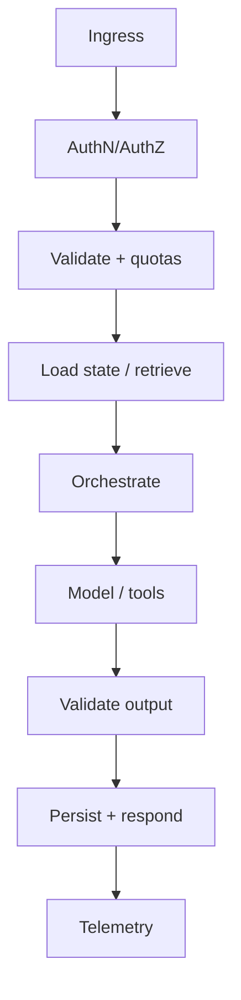
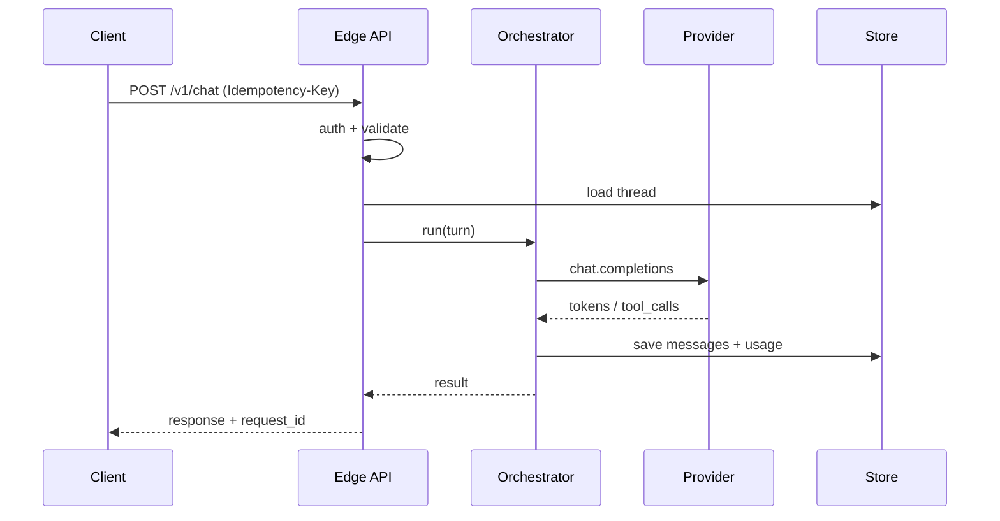

# Request Lifecycle

> Every LLM request follows a lifecycle — treat it as a pipeline with explicit stages, budgets, and observability, not a single SDK call.

## Table of Contents

- [Overview](#overview)
- [Definition](#definition)
- [Why it matters](#why-it-matters)
- [Uses](#uses)
- [How it works](#how-it-works)
- [Worked examples / scenarios](#worked-examples-scenarios)
- [Python Examples](#python-examples)
- [Production Considerations](#production-considerations)
- [Performance Considerations](#performance-considerations)
- [Cost Considerations](#cost-considerations)
- [Security Considerations](#security-considerations)
- [Best Practices](#best-practices)
- [Common Mistakes](#common-mistakes)
- [Interview Preparation](#interview-preparation)
- [Navigation](#navigation)

---

## Overview

Production incidents rarely sit "inside the model." They sit in lifecycle gaps: missing idempotency keys, prompts built after auth checks fail open, streams that never cancel upstream, or traces without correlation IDs.

This lesson maps a reference lifecycle you can implement in FastAPI (or any backend) and adapt for sync, async, and streaming modes.



> **Prerequisites:** [App vs Chat vs Agent](01-app-vs-chat-vs-agent.md)

---

## Definition

The **LLM request lifecycle** is the ordered set of stages from client ingress to final response (or job completion): authenticate, authorize, validate, assemble context, call models/tools, stream or persist results, and emit telemetry.

---

## Why it matters

| Stage skipped | Typical failure |
|---------------|-----------------|
| AuthZ on tools | Cross-tenant data leak |
| Input validation | Prompt blowups / injection |
| Output validation | Broken clients / XSS in UI |
| Cancellation | Orphaned provider spend |
| Telemetry | Blind debugging |

---

## Uses

| Mode | Lifecycle variant |
|------|-------------------|
| Sync HTTP | Single request/response; full completion before 200 |
| Streaming SSE | Headers early; tokens as events; final done event |
| Async job | 202 + `job_id`; worker runs lifecycle; client polls/webhooks |

---

## How it works

### Reference stages

1. **Ingress** — TLS terminate, request ID, rate-limit key.
2. **AuthN / AuthZ** — user/tenant identity; permission for model feature and tools.
3. **Contract validation** — schema, size limits, content policy pre-checks.
4. **Quota / budget** — tokens, $ cap, concurrency slots.
5. **State load** — thread messages, memories, feature flags.
6. **Context assembly** — prompts, RAG, tool schemas (pure functions where possible).
7. **Execution** — model calls, tool calls, retries within policy.
8. **Output gate** — schema validate, safety filters, PII redaction for logs.
9. **Persistence** — messages, usage rows, audit events.
10. **Egress** — JSON, SSE, or job status; always attach `request_id`.



Propagate `request_id` / `trace_id` to provider metadata, logs, and client headers.

---

## Worked examples / scenarios

### Happy path chat turn

User sends a message → auth OK → history loaded → model streams → assistant message saved → usage billed to tenant.

### Partial failure mid-tool

Model requests `create_ticket` → tool succeeds → second tool times out → record partial side effects and return a recoverable error with `request_id`.

### Client disconnect

Browser closes SSE → API cancels provider stream and marks the turn `cancelled`.

---

## Python Examples

### FastAPI request ID middleware

```python
import uuid
from fastapi import FastAPI, Request
from starlette.middleware.base import BaseHTTPMiddleware

app = FastAPI()

class RequestIdMiddleware(BaseHTTPMiddleware):
    async def dispatch(self, request: Request, call_next):
        rid = request.headers.get("x-request-id", str(uuid.uuid4()))
        request.state.request_id = rid
        response = await call_next(request)
        response.headers["x-request-id"] = rid
        return response

app.add_middleware(RequestIdMiddleware)
```

### Orchestrated turn

```python
async def handle_chat_turn(ctx, turn):
    await authorize(ctx, action="chat.write", thread_id=turn.thread_id)
    await check_quota(ctx.tenant_id, estimated_tokens=2_000)
    history = await threads.load(turn.thread_id, limit=40)
    prompt = build_messages(system=flags.system_prompt, history=history, user=turn.message)
    completion = await llm.chat(prompt, model=flags.model, timeout_s=60)
    await threads.append(turn.thread_id, role="user", content=turn.message)
    await threads.append(turn.thread_id, role="assistant", content=completion.text)
    await usage.record(ctx.tenant_id, completion.usage, request_id=ctx.request_id)
    return {"text": completion.text, "request_id": ctx.request_id}
```

---

## Production Considerations

- Make stages explicit in code so new engineers see the contract.
- Separate mutating stages (tools, DB writes) from pure stages (prompt build).

## Performance Considerations

- Parallelize independent loads (flags + history + entitlements).
- Avoid serial chatty DB access in the hot path.

## Cost Considerations

- Estimate tokens before calling the model; reject oversized contexts early.
- Record usage even on failures after provider charge.

## Security Considerations

- AuthZ before retrieval of tenant documents.
- Never log raw prompts containing secrets; redact.

---

## Best Practices

1. One `request_id` end-to-end.
2. Timeouts at every I/O boundary.
3. Document persistence ordering for user/assistant messages.
4. Treat provider responses as untrusted input to validators.

## Common Mistakes

- Calling the model before authz
- No cancellation on client disconnect
- Usage not recorded on streaming abort
- Mixing job lifecycle with HTTP request scope carelessly

---

## Interview Preparation

**Q: What belongs in middleware vs orchestrator?**  
**A:** Middleware: request IDs, auth parsing, coarse rate limits. Orchestrator: prompt assembly, tool loops, domain rules, persistence of conversation state.


---

## Navigation

### This section — Foundations

| # | Topic | Document |
|---|-------|----------|
| 1 | App vs Chat vs Agent | [App vs Chat vs Agent](01-app-vs-chat-vs-agent.md) |
| 2 | Request Lifecycle | **You are here** |
| 3 | Sync, Async, and Streaming | [Sync, Async, and Streaming](03-sync-async-streaming.md) |

### Path

- Previous: [App vs Chat vs Agent](01-app-vs-chat-vs-agent.md)
- Next: [Sync, Async, and Streaming](03-sync-async-streaming.md)
- Section hub: [Foundations](README.md)
- Domain hub: [LLM Application Development](../README.md)

### Related topics

- [FastAPI](../../fastapi/README.md)
- [Retries and Timeouts](../reliability/01-retries-and-timeouts.md)
- [Chat APIs](../apis-and-ux/01-chat-apis.md)

