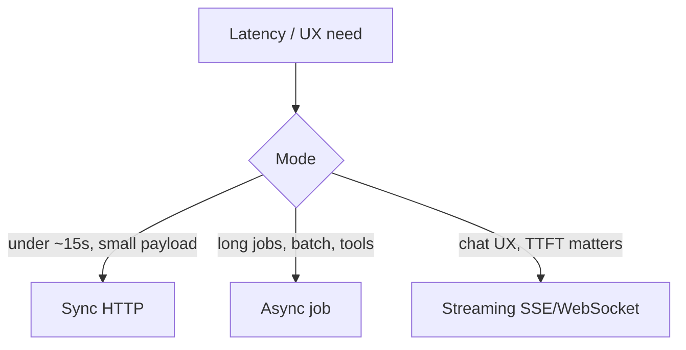
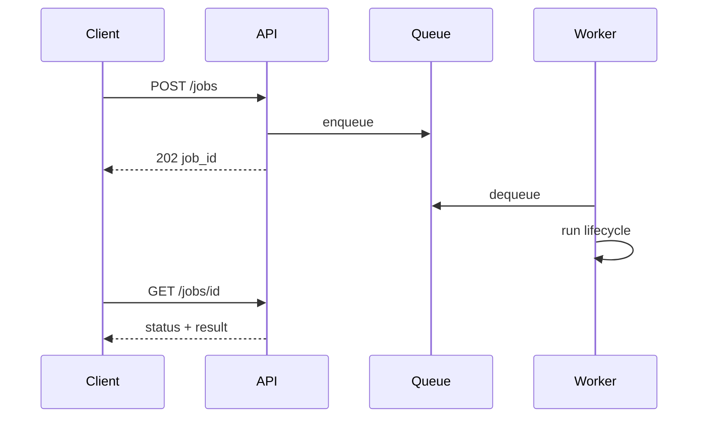

# Sync, Async, and Streaming

> Pick sync, async jobs, or streaming based on latency, UX, and failure semantics — not because streaming is fashionable.

## Table of Contents

- [Overview](#overview)
- [Definition](#definition)
- [Why it matters](#why-it-matters)
- [Uses](#uses)
- [How it works](#how-it-works)
- [Worked examples / scenarios](#worked-examples-scenarios)
- [Python Examples](#python-examples)
- [Production Considerations](#production-considerations)
- [Performance Considerations](#performance-considerations)
- [Cost Considerations](#cost-considerations)
- [Security Considerations](#security-considerations)
- [Best Practices](#best-practices)
- [Common Mistakes](#common-mistakes)
- [Interview Preparation](#interview-preparation)
- [Navigation](#navigation)

---

## Overview

LLM calls are slow and bursty compared to typical microservice RPCs. Choosing the wrong execution mode causes gateway timeouts, poor UX, or duplicated work.



> **Prerequisites:** [Request Lifecycle](02-request-lifecycle.md)

---

## Definition

An **execution mode** is how the client waits for LLM work: **sync** (block until done), **async job** (enqueue and poll/webhook), or **streaming** (incremental tokens/events over a long-lived connection).

---

## Why it matters

| Mode | Strength | Weakness |
|------|----------|----------|
| Sync | Simple clients, easy retries | Proxy timeouts; poor for long tools |
| Async job | Survives disconnects; scalable workers | More moving parts; eventual consistency |
| Streaming | Fast perceived latency | Harder cancel/retry; partial failures |

---

## Uses

| Product | Recommended mode |
|---------|------------------|
| Form "rewrite this paragraph" | Sync or short stream |
| Chat assistant | Streaming SSE |
| "Analyze 200 PDFs" | Async job + progress |
| Agent with long tool chains | Async job or stream-of-events |

---

## How it works

### Sync

Client waits; server holds the connection until completion. Keep total time under your edge timeout (often 60s).

### Async jobs



### Streaming

Send early bytes (TTFT). Prefer SSE for browser-friendly chat; WebSockets when you need bidirectional cancel/control.

### Hybrid

Stream tokens for language; for long tools, emit progress events, then resume tokens.

---

## Worked examples / scenarios

### Gateway timeout

A sync agent call runs 90s behind a 60s load balancer → client 502 while the worker still burns tokens. Fix: async job or stream with heartbeats.

### Mobile flaky network

Streaming chat drops mid-reply. Design resume with `message_id` + last event sequence, or finalize on server and let client refetch.

---

## Python Examples

### Sync endpoint

```python
@app.post("/v1/rewrite")
async def rewrite(body: RewriteRequest):
    text = await llm.complete(prompt_for(body), timeout_s=30)
    return {"text": text}
```

### Async job enqueue

```python
@app.post("/v1/jobs/analyze", status_code=202)
async def analyze(body: AnalyzeRequest, background: BackgroundTasks):
    job_id = new_id()
    await jobs.create(job_id, status="queued")
    background.add_task(run_analyze_job, job_id, body)
    return {"job_id": job_id, "status": "queued"}
```

### Streaming tokens

```python
async def stream_tokens(messages: list[dict]):
    stream = await client.chat.completions.create(
        model="gpt-4o-mini", messages=messages, stream=True,
    )
    async for event in stream:
        delta = event.choices[0].delta.content or ""
        if delta:
            yield delta
```

---

## Production Considerations

- Document max duration per mode in the API contract.
- Heartbeat SSE comments (`: ping`) to keep intermediaries from closing idle streams.

## Performance Considerations

- Streaming improves perceived latency more than total time.
- Autoscaling async workers on queue depth.

## Cost Considerations

- Disconnects mid-stream may still incur provider cost — cancel aggressively.
- Async retries need idempotency to avoid double spend.

## Security Considerations

- Job status endpoints must be tenant-scoped.
- Decide buffer-then-filter vs stream-then-risk for safety policies.

---

## Best Practices

1. Default chat to streaming; batch to async jobs.
2. Timeouts in clients and servers.
3. Progress events for multi-step work.
4. Immutable job results once terminal.

## Common Mistakes

- Sync endpoints for multi-minute agents
- No heartbeat on SSE
- Retrying non-idempotent sync calls blindly
- Assuming WebSocket is required for chat

---

## Interview Preparation

**Q: When is SSE preferable to WebSockets for LLM chat?**  
**A:** When the server primarily pushes tokens and the client rarely sends mid-stream control; SSE is simpler through HTTP proxies and browsers.


---

## Navigation

### This section — Foundations

| # | Topic | Document |
|---|-------|----------|
| 1 | App vs Chat vs Agent | [App vs Chat vs Agent](01-app-vs-chat-vs-agent.md) |
| 2 | Request Lifecycle | [Request Lifecycle](02-request-lifecycle.md) |
| 3 | Sync, Async, and Streaming | **You are here** |

### Path

- Previous: [Request Lifecycle](02-request-lifecycle.md)
- Next: [LLM App Architecture](../architecture/01-llm-app-architecture.md)
- Section hub: [Foundations](README.md)
- Domain hub: [LLM Application Development](../README.md)

### Related topics

- [Streaming and SSE](../apis-and-ux/02-streaming-and-sse.md)
- [Cancellation and Timeouts](../apis-and-ux/04-cancellation-and-timeouts.md)

