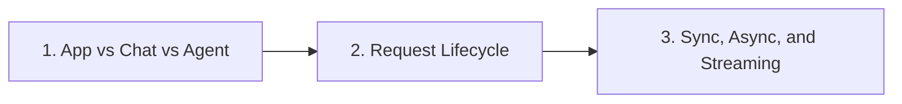

# Foundations

> App vs chat vs agent, request lifecycle, and sync/async/streaming execution models.

**Parent:** [LLM Application Development](../README.md)

---

## Topics

| # | Topic | Document |
|---|-------|----------|
| 1 | App vs Chat vs Agent | [01-app-vs-chat-vs-agent.md](01-app-vs-chat-vs-agent.md) |
| 2 | Request Lifecycle | [02-request-lifecycle.md](02-request-lifecycle.md) |
| 3 | Sync, Async, and Streaming | [03-sync-async-streaming.md](03-sync-async-streaming.md) |

---

## Learning path

