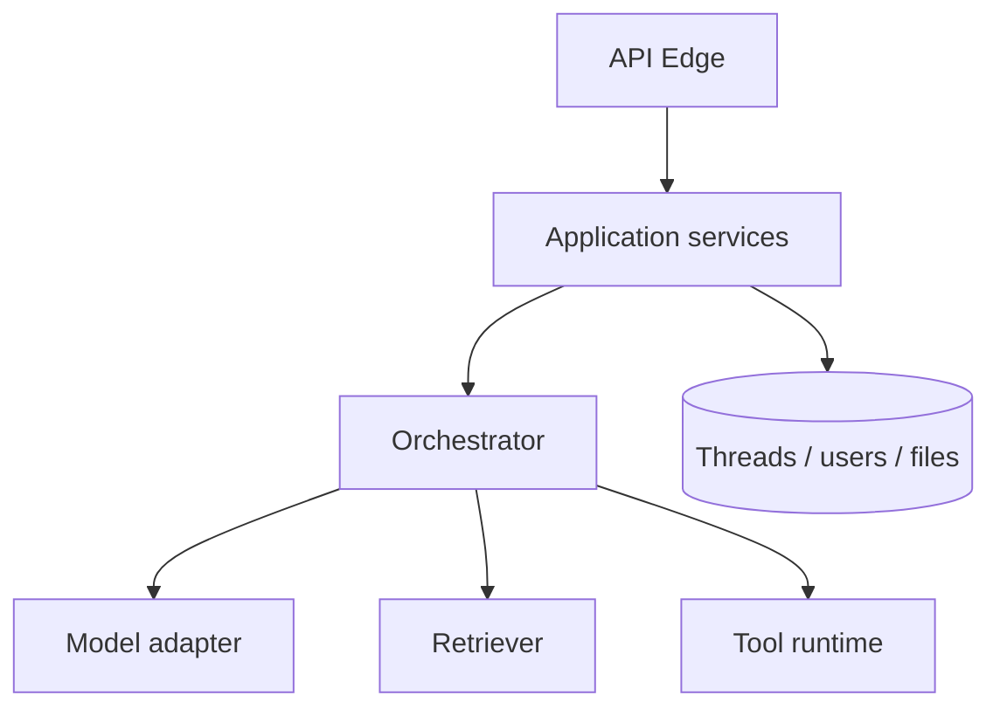

# LLM App Architecture

> A reference architecture for LLM-backed services.

## Definition

A typical LLM app has: an API edge, an orchestration layer (prompt + tools + retrieval), model provider adapters, persistence (threads/memory), and observability/eval hooks.

## Why it matters

Clear layering lets you swap models, add RAG, or introduce agents without rewriting the product.

## How it works

## Key principles

1. **Provider adapters** — Isolate vendor SDKs behind interfaces.
2. **Pure prompt builders** — Testable functions, not buried strings.
3. **Explicit state** — Don't hide critical state only inside the model.

## Common applications

| Application | Description |
|-------------|-------------|
| Chat API | Threaded conversations |
| Doc QA | RAG orchestration |
| Workflow apps | Structured multi-step jobs |

## Common mistakes

- God-object 'agent' with no boundaries
- Business rules only inside prompts

## Further reading

- [Orchestration patterns](orchestration-patterns.md)
- [AI System Design](../ai-system-design/README.md)
