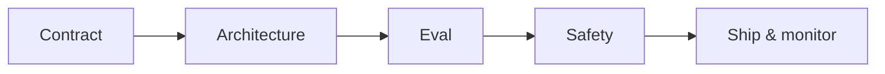

# LLM App Building Checklist

> A practical checklist from blank repo to production LLM feature.

## Definition

A checklist covering product contract, data/auth, orchestration, eval, safety, and ops concerns before you call an LLM 'done'.

## Why it matters

Teams skip steps under demo pressure. This list is the minimum engineering bar.

## How it works

## Key principles

1. **Contract first** — Inputs, outputs, must-nots.
2. **Eval before polish** — Golden set in CI.
3. **Observe generations** — Traces with redaction.

## Common applications

| Application | Description |
|-------------|-------------|
| New feature | PR checklist |
| Incident review | Which box failed? |
| Vendor swap | Adapter + eval gate |

## Common mistakes

- No authz on tools that touch customer data
- Missing cost/latency budgets

## Further reading

- [AI Deployment & Infrastructure](../ai-deployment/README.md)
- [AI Security & Guardrails](../ai-security-guardrails/README.md)
- [Capstone walkthrough](../../meta/capstone-walkthrough.md)
