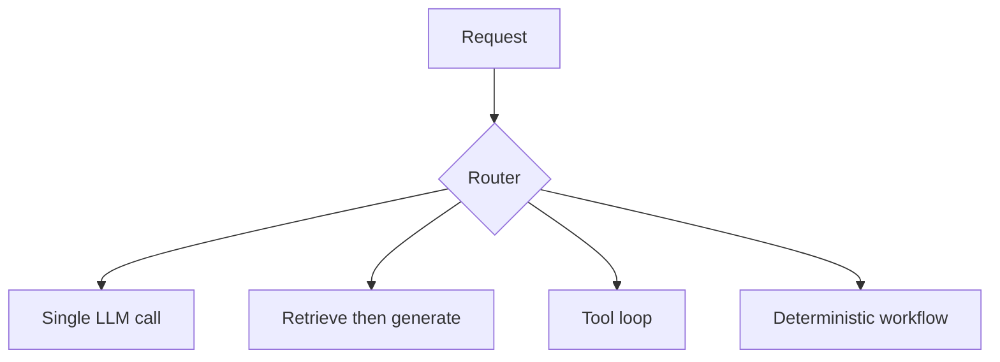

# Orchestration Patterns

> Sequential chains, routers, tool loops, and workflows — when to use each.

## Definition

Orchestration is the control flow around model calls. Patterns include: single-call, chain, router, tool-calling loop, DAG workflow, and human-in-the-loop. Pick the simplest pattern that meets reliability needs.

## Why it matters

Over-orchestrating creates latency and failure surfaces; under-orchestrating pushes too much onto one fragile prompt.

## How it works

## Key principles

1. **Simplest winning pattern** — Prefer RAG/chain before agents.
2. **Determinism where required** — Use code for invariants; LLMs for language.
3. **Timeouts & budgets** — Cap steps, tokens, and tool calls.

## Common applications

| Application | Description |
|-------------|-------------|
| FAQ bot | Router + RAG |
| Ops assistant | Tool loop with allowlists |
| ETL+summary | DAG workflow |

## Common mistakes

- Agentizing a pure retrieval problem
- Unbounded tool loops without budgets

## Further reading

- [AI Agents](../ai-agents/README.md)
- [Agentic AI](../agentic-ai/README.md)
