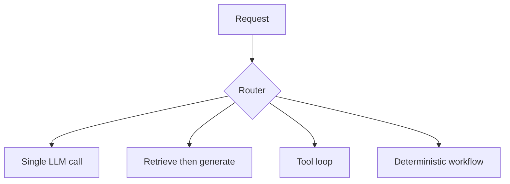
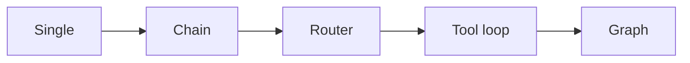

# Orchestration Patterns

> Sequential chains, routers, tool loops, and workflows — pick the simplest orchestration pattern that meets reliability needs.

## Table of Contents

- [Overview](#overview)
- [Definition](#definition)
- [Why it matters](#why-it-matters)
- [Uses](#uses)
- [How it works](#how-it-works)
- [Worked examples / scenarios](#worked-examples-scenarios)
- [Python Examples](#python-examples)
- [Production Considerations](#production-considerations)
- [Performance Considerations](#performance-considerations)
- [Cost Considerations](#cost-considerations)
- [Security Considerations](#security-considerations)
- [Best Practices](#best-practices)
- [Common Mistakes](#common-mistakes)
- [Interview Preparation](#interview-preparation)
- [Navigation](#navigation)

---

## Overview

Orchestration is the control flow around model calls. Over-orchestrating creates latency and failure surfaces; under-orchestrating pushes too much onto one fragile prompt.



> **Prerequisites:** [LLM App Architecture](../architecture/01-llm-app-architecture.md) · [App vs Chat vs Agent](../../foundations/01-app-vs-chat-vs-agent.md)

---

## Definition

**Orchestration** is the control flow around model calls. Patterns include: single-call, chain, router, tool-calling loop, DAG workflow, and human-in-the-loop. Pick the simplest pattern that meets reliability needs.

---

## Why it matters

| Pattern mismatch | Result |
|------------------|--------|
| Agent for FAQ | Slow, flaky, expensive |
| Single call for multi-system ops | Hallucinated side effects |
| Unbounded tool loop | Runaway cost |

---

## Uses

| Application | Pattern |
|-------------|---------|
| FAQ bot | Router + RAG |
| Ops assistant | Tool loop with allowlists |
| ETL + summary | DAG workflow |
| Form extraction | Single-call structured output |

---

## How it works

### Pattern catalog

| Pattern | Control | Typical stop |
|---------|---------|--------------|
| Single-call | One completion | Response returned |
| Chain / pipeline | Fixed stages | Last stage |
| Router | Classify then branch | Branch completes |
| Tool loop | Model selects tools | Budget / final answer |
| Graph / DAG | Explicit edges | Terminal node |
| HITL | Pause for human | Approval / reject |

### Key principles

1. **Simplest winning pattern** — Prefer RAG/chain before agents.
2. **Determinism where required** — Use code for invariants; LLMs for language.
3. **Timeouts & budgets** — Cap steps, tokens, and tool calls.



---

## Worked examples / scenarios

### FAQ that became an agent

Team wrapped docs QA in an agent framework. Latency 8s → 25s with no quality gain. Fix: retrieve-then-generate chain + intent router for "talk to human".

### Ops assistant

Allowlist `get_logs`, `restart_service` (with approval), max 10 steps — tool loop is justified.

---

## Python Examples

### Pattern selector

```python
from enum import Enum

class Pattern(str, Enum):
    SINGLE = "single"
    RAG = "rag"
    TOOL_LOOP = "tool_loop"

async def handle(intent: str, payload):
    pattern = await route_intent(intent)
    if pattern == Pattern.SINGLE:
        return await single_call(payload)
    if pattern == Pattern.RAG:
        docs = await retrieve(payload.query)
        return await generate(payload.query, docs)
    return await tool_loop(payload, budget=AgentBudget())
```

### Budgeted tool loop sketch

```python
async def tool_loop(payload, budget: AgentBudget):
    messages = build_initial(payload)
    state = {"steps": 0, "tool_calls": 0, "tokens": 0}
    while True:
        reason = should_stop(state, budget)
        if reason:
            return finalize(messages, reason)
        resp = await llm.chat(messages, tools=TOOLS)
        state["steps"] += 1
        if resp.tool_calls:
            for tc in resp.tool_calls:
                state["tool_calls"] += 1
                result = await run_tool(tc)
                messages.append(tool_message(tc, result))
        else:
            return resp.text
```

---

## Production Considerations

- Log which pattern ran per request for debugging.
- Feature-flag pattern upgrades (chain → agent) carefully.

## Performance Considerations

- Parallelize independent retrieval/tools.
- Short-circuit routers with rules before LLM classifiers when possible.

## Cost Considerations

- Measure average steps/tokens per pattern.
- Use small models for routing.

## Security Considerations

- Allowlists for tools; never 'run arbitrary code' without sandbox.
- HITL for irreversible actions.

---

## Best Practices

1. Start single-call; add structure only when eval fails.
2. Encode budgets in config.
3. Prefer deterministic graphs for compliance workflows.
4. Separate routing accuracy metrics from answer quality.

## Common Mistakes

- Agentizing a pure retrieval problem
- Unbounded tool loops without budgets
- Silent pattern switches in production
- Mixing HITL and fully automatic paths without UX cues

---

## Interview Preparation

**Q: When do you choose a tool loop over a fixed chain?**  
**A:** When the set or order of tools cannot be known ahead of time and you can enforce budgets and allowlists. If the steps are fixed, a chain/DAG is simpler and more reliable.


---

## Navigation

### This section — Orchestration

| # | Topic | Document |
|---|-------|----------|
| 1 | Orchestration Patterns | **You are here** |
| 2 | Chains and Pipelines | [Chains and Pipelines](02-chains-and-pipelines.md) |
| 3 | Routers and Classifiers | [Routers and Classifiers](03-routers-and-classifiers.md) |
| 4 | Graph-Based Workflows | [Graph-Based Workflows](04-graph-based-workflows.md) |

### Path

- Previous: [Multi-Tenant LLM Apps](../architecture/04-multi-tenant-llm-apps.md)
- Next: [Chains and Pipelines](02-chains-and-pipelines.md)
- Section hub: [Orchestration](README.md)
- Domain hub: [LLM Application Development](../README.md)

### Related topics

- [AI Agents](../../ai-agents/README.md)
- [Agentic AI](../../agentic-ai/README.md)
- [Chains and Pipelines](02-chains-and-pipelines.md)

