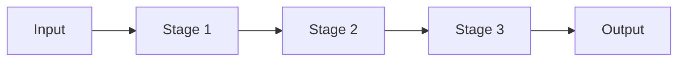
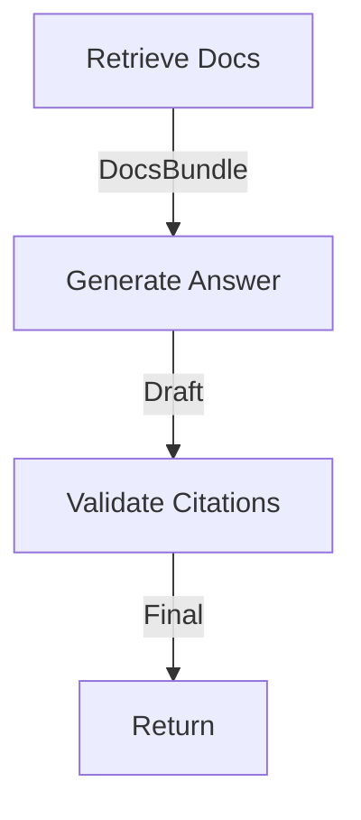

# Chains and Pipelines

> Chains and pipelines fix the step order in code — great when the workflow is known and each stage has a clear contract.

## Table of Contents

- [Overview](#overview)
- [Definition](#definition)
- [Why it matters](#why-it-matters)
- [Uses](#uses)
- [How it works](#how-it-works)
- [Worked examples / scenarios](#worked-examples-scenarios)
- [Python Examples](#python-examples)
- [Production Considerations](#production-considerations)
- [Performance Considerations](#performance-considerations)
- [Cost Considerations](#cost-considerations)
- [Security Considerations](#security-considerations)
- [Best Practices](#best-practices)
- [Common Mistakes](#common-mistakes)
- [Interview Preparation](#interview-preparation)
- [Navigation](#navigation)

---

## Overview

A **chain** is a linear sequence of stages (retrieve → draft → critique → format). A **pipeline** emphasizes batch/stream processing with the same idea: explicit stages, typed intermediates, and isolated failures.



> **Prerequisites:** [Orchestration Patterns](01-orchestration-patterns.md)

---

## Definition

A **chain/pipeline** is an orchestration style where stages run in a predetermined order, each consuming a validated intermediate artifact from the previous stage.

---

## Why it matters

| Benefit | Detail |
|---------|--------|
| Debuggability | Fail at stage N with artifact N-1 |
| Eval | Score stages independently |
| Caching | Reuse retrieval across generations |
| Compliance | Prove which steps ran |

---

## Uses

| Pipeline | Stages |
|----------|--------|
| RAG answer | Retrieve → rerank → generate → cite check |
| Content | Outline → draft → style → safety |
| Support | Classify → retrieve macros → draft reply |

---

## How it works

### Stage contract

Each stage declares input/output schemas (Pydantic). The chain runner validates between stages.



### Fan-out / fan-in

Map-reduce summarization: split docs → summarize parts in parallel → reduce summary.

---

## Worked examples / scenarios

### Citation checker stage

Generation claims doc IDs; validator stage ensures every citation exists in `DocsBundle` or strips/flags it.

### Partial reuse

User regenerates answer with new tone: reuse cached retrieve/rerank stages; only re-run generate.

---

## Python Examples

### Simple chain runner

```python
from typing import Callable, Any

async def run_chain(stages: list[Callable], data: Any):
    for stage in stages:
        data = await stage(data)
        # optional: schema validate here
    return data

async def retrieve(ctx): ...
async def generate(ctx): ...
async def cite_check(ctx): ...

result = await run_chain([retrieve, generate, cite_check], ctx)
```

### Parallel map stage

```python
import asyncio

async def map_summarize(chunks: list[str]) -> list[str]:
    return await asyncio.gather(*[summarize_one(c) for c in chunks])
```

---

## Production Considerations

- Persist stage artifacts for audit when required.
- Idempotent stages help retries.

## Performance Considerations

- Parallelize independent stages only.
- Bound concurrency for map stages.

## Cost Considerations

- Cache expensive early stages.
- Use smaller models for outline/classify stages.

## Security Considerations

- Validate untrusted stage outputs before tools.
- Do not pass raw user PII to every stage if unnecessary.

---

## Best Practices

1. Name stages and emit spans per stage.
2. Keep stages under ~1 responsibility.
3. Prefer code branching over another LLM when rules are crisp.
4. Golden-test each stage.

## Common Mistakes

- Giant mega-prompt instead of stages when eval demands modularity
- No schema between stages
- Hidden shared mutable state
- Unbounded fan-out

---

## Interview Preparation

**Q: Chain vs agent?**  
**A:** Chains fix control flow in code; agents let the model choose next actions. Use chains when the path is known.


---

## Navigation

### This section — Orchestration

| # | Topic | Document |
|---|-------|----------|
| 1 | Orchestration Patterns | [Orchestration Patterns](01-orchestration-patterns.md) |
| 2 | Chains and Pipelines | **You are here** |
| 3 | Routers and Classifiers | [Routers and Classifiers](03-routers-and-classifiers.md) |
| 4 | Graph-Based Workflows | [Graph-Based Workflows](04-graph-based-workflows.md) |

### Path

- Previous: [Orchestration Patterns](01-orchestration-patterns.md)
- Next: [Routers and Classifiers](03-routers-and-classifiers.md)
- Section hub: [Orchestration](README.md)
- Domain hub: [LLM Application Development](../README.md)

### Related topics

- [Prompt Chaining](../../prompt-engineering/reasoning-strategies/02-prompt-chaining.md)
- [Graph-Based Workflows](04-graph-based-workflows.md)

