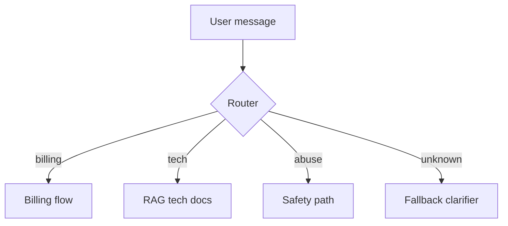
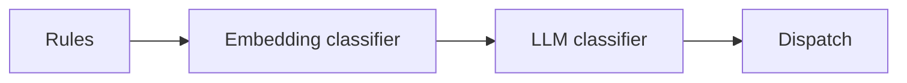

# Routers and Classifiers

> Routers send each request to the right lane — rules first, LLM classifiers when language is messy, always with a fallback lane.

## Table of Contents

- [Overview](#overview)
- [Definition](#definition)
- [Why it matters](#why-it-matters)
- [Uses](#uses)
- [How it works](#how-it-works)
- [Worked examples / scenarios](#worked-examples-scenarios)
- [Python Examples](#python-examples)
- [Production Considerations](#production-considerations)
- [Performance Considerations](#performance-considerations)
- [Cost Considerations](#cost-considerations)
- [Security Considerations](#security-considerations)
- [Best Practices](#best-practices)
- [Common Mistakes](#common-mistakes)
- [Interview Preparation](#interview-preparation)
- [Navigation](#navigation)

---

## Overview

Not every message should hit your strongest model or heaviest workflow. Routers classify intent, risk, or language and dispatch accordingly.



> **Prerequisites:** [Orchestration Patterns](01-orchestration-patterns.md)

---

## Definition

A **router** selects a downstream path (prompt, model, tools, or workflow) based on **rules** and/or a **classifier** (often an LLM or smaller model) applied to the request.

---

## Why it matters

| Without routing | With routing |
|-----------------|--------------|
| One mega-prompt | Specialized prompts |
| Always large model | Cheap model for easy intents |
| No safety lane | Dedicated abuse handling |

---

## Uses

| Signal | Route by |
|--------|----------|
| Intent | billing / tech / chitchat |
| Risk | high → stronger model + HITL |
| Language | locale-specific prompts |
| Tenant plan | feature entitlement |

---

## How it works

### Layered routing

1. **Hard rules** — regex, entitlements, maintenance mode.
2. **Lightweight classifier** — embeddings/small model.
3. **LLM classifier** — structured label + confidence.
4. **Fallback** — clarify or general assistant.



### Confidence

If confidence < threshold, do not silently guess — ask a clarifying question or use the safe default path.

---

## Worked examples / scenarios

### Cost saver

80% of traffic is FAQ → small model RAG. Escalations → large model. Router accuracy becomes a cost KPI.

### Safety

Classifier labels `self_harm` → fixed policy response path, no tools.

---

## Python Examples

### Structured LLM router

```python
from pydantic import BaseModel
from typing import Literal

class Route(BaseModel):
    intent: Literal["billing", "tech", "other"]
    confidence: float

async def classify(message: str) -> Route:
    resp = await client.beta.chat.completions.parse(
        model="gpt-4o-mini",
        messages=[
            {"role": "system", "content": "Classify support intent."},
            {"role": "user", "content": message},
        ],
        response_format=Route,
    )
    return resp.choices[0].message.parsed

async def dispatch(message: str):
    route = await classify(message)
    if route.confidence < 0.6:
        return await clarify(message)
    return await HANDLERS[route.intent](message)
```

---

## Production Considerations

- Monitor confusion matrix of router labels vs human tags.
- Version router prompts like any other prompt.

## Performance Considerations

- Cache embeddings for classifier.
- Short-circuit rules before any model call.

## Cost Considerations

- Routing calls should be cheaper than main calls.
- Avoid double-LLM when rules suffice.

## Security Considerations

- Never let the router disable authz.
- Jailbreak attempts → safety path.

---

## Best Practices

1. Rules before models.
2. Explicit unknown/fallback intent.
3. Thresholds from eval, not vibes.
4. Log route + confidence on every request.

## Common Mistakes

- Infinite clarify loops
- Routing only in the system prompt of a single call
- No evaluation set for intents
- Using the same large model for routing and answering always

---

## Interview Preparation

**Q: How do you evaluate a router?**  
**A:** Labeled intent dataset; track precision/recall per class, plus downstream task success and cost after routing.


---

## Navigation

### This section — Orchestration

| # | Topic | Document |
|---|-------|----------|
| 1 | Orchestration Patterns | [Orchestration Patterns](01-orchestration-patterns.md) |
| 2 | Chains and Pipelines | [Chains and Pipelines](02-chains-and-pipelines.md) |
| 3 | Routers and Classifiers | **You are here** |
| 4 | Graph-Based Workflows | [Graph-Based Workflows](04-graph-based-workflows.md) |

### Path

- Previous: [Chains and Pipelines](02-chains-and-pipelines.md)
- Next: [Graph-Based Workflows](04-graph-based-workflows.md)
- Section hub: [Orchestration](README.md)
- Domain hub: [LLM Application Development](../README.md)

### Related topics

- [Graceful Degradation](../reliability/04-graceful-degradation.md)
- [Orchestration Patterns](01-orchestration-patterns.md)

