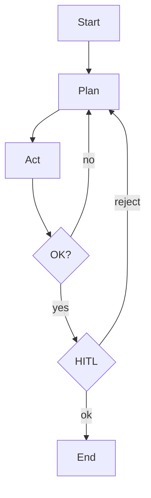
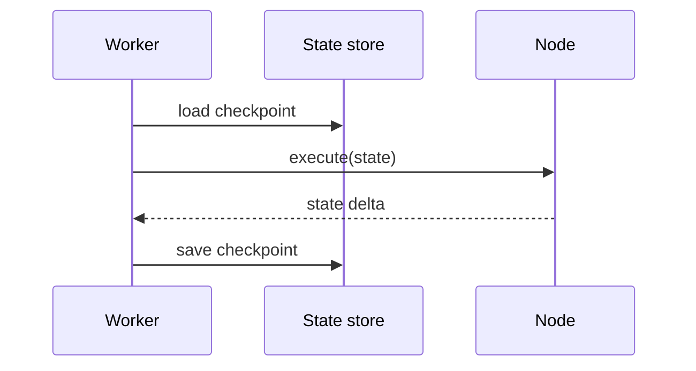

# Graph-Based Workflows

> When control flow branches, loops, and pauses for humans, model it as an explicit graph with state and checkpoints — not a spaghetti script.

## Table of Contents

- [Overview](#overview)
- [Definition](#definition)
- [Why it matters](#why-it-matters)
- [Uses](#uses)
- [How it works](#how-it-works)
- [Worked examples / scenarios](#worked-examples-scenarios)
- [Python Examples](#python-examples)
- [Production Considerations](#production-considerations)
- [Performance Considerations](#performance-considerations)
- [Cost Considerations](#cost-considerations)
- [Security Considerations](#security-considerations)
- [Best Practices](#best-practices)
- [Common Mistakes](#common-mistakes)
- [Interview Preparation](#interview-preparation)
- [Navigation](#navigation)

---

## Overview

Graphs generalize chains: nodes are LLM/tool/code steps; edges encode transitions. Use them for durable workflows, branching compliance paths, and recoverable agent runs.



> **Prerequisites:** [Chains and Pipelines](02-chains-and-pipelines.md)

---

## Definition

A **graph-based workflow** represents orchestration as nodes and edges over shared **state**, often with **checkpoints** for durability, retries, and human-in-the-loop interrupts.

---

## Why it matters

| Need | Graph helps |
|------|-------------|
| Branching compliance | Explicit edges |
| Long-running jobs | Checkpointed state |
| HITL | Interrupt nodes |
| Replay/debug | Inspect state per node |

---

## Uses

| Workflow | Graph shape |
|----------|-------------|
| Claims processing | DAG with parallel extractors |
| Coding agent | Cyclic plan-act-check with max iterations |
| Publishing | Linear with mandatory review node |

---

## How it works

### State machine mindset

Define `WorkflowState` fields. Each node returns a partial update. The runtime merges updates and selects the next edge.

### Durability

Persist checkpoint after each node so workers can resume after deploy or crash.



---

## Worked examples / scenarios

### Approval gate

After `draft_email`, edge goes to `wait_for_human`. API exposes approve/reject; rejection edge returns to `draft_email` with feedback.

### Max-iteration cycle

`plan → act → check` with `iteration < N` guard edge to `escalate`.

---

## Python Examples

### Minimal graph runner

```python
from typing import Callable

NodeFn = Callable[[dict], dict]

def run_graph(start: str, nodes: dict[str, NodeFn], edges: dict[str, Callable[[dict], str]], state: dict):
    current = start
    while current != "END":
        state.update(nodes[current](state))
        current = edges[current](state)
    return state

nodes = {
    "draft": lambda s: {**s, "draft": "hello"},
    "check": lambda s: {**s, "ok": True},
}
edges = {
    "draft": lambda s: "check",
    "check": lambda s: "END" if s.get("ok") else "draft",
}
```

---

## Production Considerations

- Version graph definitions; migrate in-flight state carefully.
- Emit node-level metrics (latency, failure).

## Performance Considerations

- Parallelize diamond DAG branches.
- Avoid huge state blobs; store large artifacts by reference.

## Cost Considerations

- Cap cyclic edges.
- Prefer cheaper models on exploratory nodes.

## Security Considerations

- HITL for side-effect nodes.
- Sign/verify approval tokens.

---

## Best Practices

1. Make edges pure functions of state.
2. Checkpoint after side effects.
3. Visualize graphs in docs.
4. Test each node in isolation.

## Common Mistakes

- Implicit graph in nested if/else with no diagram
- Unbounded cycles
- Mutating global state outside the state object
- No migration plan for in-flight runs

---

## Interview Preparation

**Q: When is a graph worth it over a chain?**  
**A:** When you need branching, cycles with budgets, durability, or human interrupts that a linear pipeline cannot express cleanly.


---

## Navigation

### This section — Orchestration

| # | Topic | Document |
|---|-------|----------|
| 1 | Orchestration Patterns | [Orchestration Patterns](01-orchestration-patterns.md) |
| 2 | Chains and Pipelines | [Chains and Pipelines](02-chains-and-pipelines.md) |
| 3 | Routers and Classifiers | [Routers and Classifiers](03-routers-and-classifiers.md) |
| 4 | Graph-Based Workflows | **You are here** |

### Path

- Previous: [Routers and Classifiers](03-routers-and-classifiers.md)
- Next: [Chat APIs](../apis-and-ux/01-chat-apis.md)
- Section hub: [Orchestration](README.md)
- Domain hub: [LLM Application Development](../README.md)

### Related topics

- [Agentic AI](../../agentic-ai/README.md)
- [Orchestration Patterns](01-orchestration-patterns.md)

