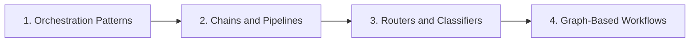

# Orchestration

> Control-flow patterns: chains, routers, classifiers, and graph-based workflows.

**Parent:** [LLM Application Development](../README.md)

---

## Topics

| # | Topic | Document |
|---|-------|----------|
| 1 | Orchestration Patterns | [01-orchestration-patterns.md](01-orchestration-patterns.md) |
| 2 | Chains and Pipelines | [02-chains-and-pipelines.md](02-chains-and-pipelines.md) |
| 3 | Routers and Classifiers | [03-routers-and-classifiers.md](03-routers-and-classifiers.md) |
| 4 | Graph-Based Workflows | [04-graph-based-workflows.md](04-graph-based-workflows.md) |

---

## Learning path

