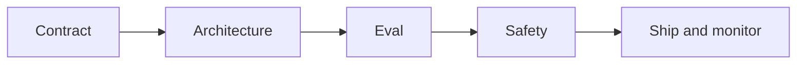
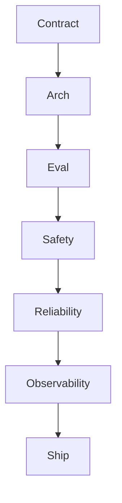

# LLM App Building Checklist

> A practical checklist from blank repo to production LLM feature — the minimum engineering bar before you call it done.

## Table of Contents

- [Overview](#overview)
- [Definition](#definition)
- [Why it matters](#why-it-matters)
- [Uses](#uses)
- [How it works](#how-it-works)
- [Worked examples / scenarios](#worked-examples-scenarios)
- [Python Examples](#python-examples)
- [Production Considerations](#production-considerations)
- [Performance Considerations](#performance-considerations)
- [Cost Considerations](#cost-considerations)
- [Security Considerations](#security-considerations)
- [Best Practices](#best-practices)
- [Common Mistakes](#common-mistakes)
- [Interview Preparation](#interview-preparation)
- [Navigation](#navigation)

---

## Overview

Teams skip steps under demo pressure. This checklist is the minimum engineering bar across product contract, architecture, eval, safety, and operations.



> **Prerequisites:** [LLM App Architecture](../architecture/01-llm-app-architecture.md) · [Orchestration Patterns](../orchestration/01-orchestration-patterns.md)

---

## Definition

An **LLM app building checklist** is a structured set of gates covering product contract, data/auth, orchestration, evaluation, safety, and ops concerns before an LLM feature is considered production-ready.

---

## Why it matters

| Skipped gate | Typical incident |
|--------------|------------------|
| No eval | Silent quality regressions |
| No authz on tools | Data leak |
| No budgets | Cost spike |
| No traces | Cannot debug |

---

## Uses

| Use | How |
|-----|-----|
| New feature | PR checklist |
| Incident review | Which box failed? |
| Vendor swap | Adapter + eval gate |

---

## How it works

### Checklist sections

1. **Contract** — inputs, outputs, must-nots, latency/cost SLO.
2. **Architecture** — shape (app/chat/agent), adapters, persistence.
3. **Eval** — golden set, online metrics, regression CI.
4. **Safety** — injection, tool authz, PII, content policy.
5. **Reliability** — timeouts, retries, idempotency, degradation.
6. **Observability** — traces, usage, alerts.
7. **Rollout** — flags, canary, rollback.



### Key principles

1. **Contract first** — Inputs, outputs, must-nots.
2. **Eval before polish** — Golden set in CI.
3. **Observe generations** — Traces with redaction.

---

## Worked examples / scenarios

### Demo → prod gap

Feature works in playground with pasted docs; prod lacks retrieval authz filters. Checklist would have blocked ship.

### Vendor swap

New model: adapters green, golden set 3% worse on citations → rollback flag.

---

## Python Examples

### CI golden eval stub

```python
import pytest

CASES = [
    {"q": "What is the refund window?", "must_include": ["30 days"]},
]

@pytest.mark.asyncio
async def test_golden_refund_policy(orch):
    for case in CASES:
        out = await orch.answer(case["q"])
        for needle in case["must_include"]:
            assert needle.lower() in out.text.lower()
```

### Preflight assert

```python
def preflight(cfg):
    assert cfg.model, "model required"
    assert cfg.timeout_s > 0
    assert cfg.max_tool_calls > 0
    assert cfg.tenant_isolation is True
```

---

## Production Considerations

- Keep the checklist in-repo next to the feature.
- Require named owners for eval and safety.

## Performance Considerations

- Record p95 TTFT and end-to-end in the contract.
- Load-test streaming concurrency.

## Cost Considerations

- Set daily $ kill switches.
- Estimate tokens per request class.

## Security Considerations

- Threat-model tools and retrieval.
- Red-team prompt injection before GA.

---

## Best Practices

1. Contract → eval → ship.
2. Checklist in PR template.
3. No prod without traces.
4. Rollback plan written before canary.

## Common Mistakes

- No authz on tools that touch customer data
- Missing cost/latency budgets
- Evaluating only vibe checks
- Shipping without a flag

---

## Interview Preparation

**Q: What is the minimum bar to ship an LLM feature?**  
**A:** Clear contract, tenant-safe data paths, golden eval in CI, safety/authz on tools, timeouts/budgets, observability, and a flagged rollout with rollback.


---

## Navigation

### This section — Production

| # | Topic | Document |
|---|-------|----------|
| 1 | LLM App Building Checklist | **You are here** |
| 2 | Config and Feature Flags | [Config and Feature Flags](02-config-and-feature-flags.md) |
| 3 | Release and Rollout | [Release and Rollout](03-release-and-rollout.md) |
| 4 | Observability Hooks | [Observability Hooks](04-observability-hooks.md) |

### Path

- Previous: [Graceful Degradation](../reliability/04-graceful-degradation.md)
- Next: [Config and Feature Flags](02-config-and-feature-flags.md)
- Section hub: [Production](README.md)
- Domain hub: [LLM Application Development](../README.md)

### Related topics

- [AI Deployment](../../ai-deployment/README.md)
- [AI Security & Guardrails](../../ai-security-guardrails/README.md)
- [Capstone walkthrough](../../../meta/capstone-walkthrough.md)

