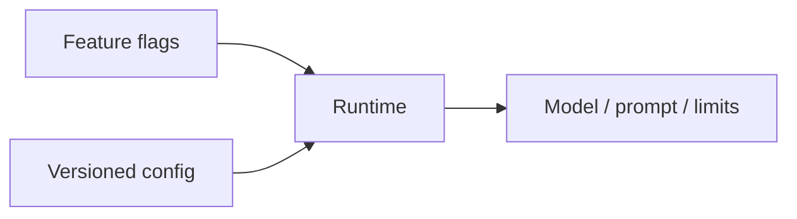
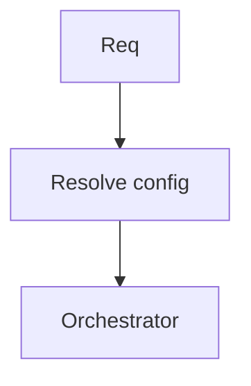

# Config and Feature Flags

> Put models, prompts, and budgets behind config and flags so you can change behavior without emergency deploys.

## Table of Contents

- [Overview](#overview)
- [Definition](#definition)
- [Why it matters](#why-it-matters)
- [Uses](#uses)
- [How it works](#how-it-works)
- [Worked examples / scenarios](#worked-examples-scenarios)
- [Python Examples](#python-examples)
- [Production Considerations](#production-considerations)
- [Performance Considerations](#performance-considerations)
- [Cost Considerations](#cost-considerations)
- [Security Considerations](#security-considerations)
- [Best Practices](#best-practices)
- [Common Mistakes](#common-mistakes)
- [Interview Preparation](#interview-preparation)
- [Navigation](#navigation)

---

## Overview

Hardcoded model names and prompts force redeploys for every tweak. Central config plus feature flags enable canaries, per-tenant overrides, and instant kill switches.



> **Prerequisites:** [LLM App Building Checklist](01-llm-app-building-checklist.md)

---

## Definition

**Config** is versioned operational parameters (models, limits, endpoints). **Feature flags** are runtime switches that gate features or experiments for subsets of users/tenants without redeploying code.

---

## Why it matters

| Hardcoded | Config + flags |
|-----------|----------------|
| Redeploy for model swap | Toggle alias |
| All-or-nothing launch | % canary |
| No kill switch | Instant disable |

---

## Uses

| Flag | Purpose |
|------|---------|
| `llm_chat_v2` | New orchestrator path |
| `model_alias=support` | Model routing |
| `tools_refund` | Entitlement + risk |
| `prompt_version` | Prompt experiment |

---

## How it works

### Layers

1. Defaults in code (safe).
2. Environment / secret store (keys, base URLs).
3. Dynamic config (models, budgets).
4. Flags (per user/tenant/percentage).

Resolve: `flag override > tenant config > global config > default`.



---

## Worked examples / scenarios

### Prompt regression

Flag `prompt_v3` at 5% traffic; eval metrics drop → kill flag; no rollback deploy needed.

### Enterprise override

Tenant config forces `region=eu` and `model=eu-strong`.

---

## Python Examples

### Resolution

```python
@dataclass
class LLMConfig:
    model: str = "gpt-4o-mini"
    temperature: float = 0
    max_tokens: int = 2048
    prompt_version: str = "v2"

def resolve(tenant_id: str, user_id: str) -> LLMConfig:
    cfg = LLMConfig()
    cfg = apply_global(cfg)
    cfg = apply_tenant(cfg, tenant_id)
    if flags.enabled("prompt_v3", user_id=user_id):
        cfg.prompt_version = "v3"
    return cfg
```

---

## Production Considerations

- Audit flag changes.
- Separate secrets from feature config.

## Performance Considerations

- Cache flag evaluation with short TTL.
- Avoid blocking network on the hot path without timeouts.

## Cost Considerations

- Flag expensive models to small cohorts first.
- Budget flags per tenant plan.

## Security Considerations

- Do not put secrets in flag payloads.
- Restrict who can enable mutating tools flags.

---

## Best Practices

1. Default safe.
2. Name flags with expiry owners.
3. Log resolved config on each request (non-secret).
4. Clean up stale flags.

## Common Mistakes

- Long-lived flags forever
- Config in random env vars with no schema
- Enabling tools globally without entitlements
- No audit trail

---

## Interview Preparation

**Q: What belongs in flags vs config vs code?**  
**A:** Code: behavior structure. Config: parameters. Flags: who gets which behavior when. Secrets never in flags.


---

## Navigation

### This section — Production

| # | Topic | Document |
|---|-------|----------|
| 1 | LLM App Building Checklist | [LLM App Building Checklist](01-llm-app-building-checklist.md) |
| 2 | Config and Feature Flags | **You are here** |
| 3 | Release and Rollout | [Release and Rollout](03-release-and-rollout.md) |
| 4 | Observability Hooks | [Observability Hooks](04-observability-hooks.md) |

### Path

- Previous: [LLM App Building Checklist](01-llm-app-building-checklist.md)
- Next: [Release and Rollout](03-release-and-rollout.md)
- Section hub: [Production](README.md)
- Domain hub: [LLM Application Development](../README.md)

### Related topics

- [Release and Rollout](03-release-and-rollout.md)
- [Multi-Tenant LLM Apps](../architecture/04-multi-tenant-llm-apps.md)

