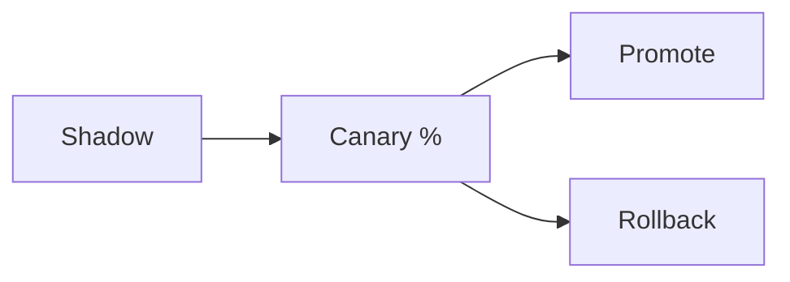
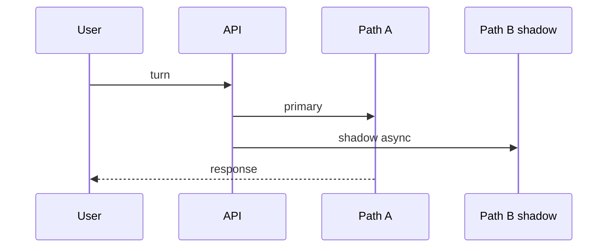

# Release and Rollout

> Release LLM changes like risky infrastructure — canary, measure quality/cost/latency, then promote or roll back.

## Table of Contents

- [Overview](#overview)
- [Definition](#definition)
- [Why it matters](#why-it-matters)
- [Uses](#uses)
- [How it works](#how-it-works)
- [Worked examples / scenarios](#worked-examples-scenarios)
- [Python Examples](#python-examples)
- [Production Considerations](#production-considerations)
- [Performance Considerations](#performance-considerations)
- [Cost Considerations](#cost-considerations)
- [Security Considerations](#security-considerations)
- [Best Practices](#best-practices)
- [Common Mistakes](#common-mistakes)
- [Interview Preparation](#interview-preparation)
- [Navigation](#navigation)

---

## Overview

LLM changes fail differently from typical deploys: latency OK, quality worse; or cost doubles with similar UX. Rollouts need eval signals, not only red/green health checks.



> **Prerequisites:** [Config and Feature Flags](02-config-and-feature-flags.md)

---

## Definition

An **LLM release/rollout** is the controlled promotion of prompts, models, or orchestration changes across traffic cohorts, gated by quality, latency, cost, and error metrics, with a fast rollback path.

---

## Why it matters

| Big bang deploy | Staged rollout |
|-----------------|----------------|
| Global regression | Limited blast radius |
| Slow learning | Metric-driven promote |
| Hard rollback | Flag off |

---

## Uses

| Technique | When |
|-----------|------|
| Shadow traffic | Compare models offline-online |
| Canary 1→5→25→100% | Standard prompt/model changes |
| Tenant allowlist | Enterprise early access |
| Blue/green workers | Async job graph changes |

---

## How it works

### Gates

Promote only if: error rate stable, p95 latency within SLO, cost per request within budget, offline/online quality metrics within tolerance.

### Shadowing

Run new path in parallel; do not show output; log diffs for eval. Mind double cost.



---

## Worked examples / scenarios

### Cost surprise

Canary of larger model: quality +2%, cost +3x → do not promote; try routing only hard intents.

### Prompt canary

5% users on `prompt_v4`; citation metric drops → flag off in minutes.

---

## Python Examples

### Canary choose

```python
import hashlib

def in_canary(user_id: str, percent: int, salt: str = "chat_v2") -> bool:
    h = hashlib.sha256(f"{salt}:{user_id}".encode()).hexdigest()
    bucket = int(h[:8], 16) % 100
    return bucket < percent
```

---

## Production Considerations

- Written rollback steps.
- Freeze windows for high-risk changes.

## Performance Considerations

- Watch stream TTFT during canary.
- Separate canary pools if noisy neighbor risk.

## Cost Considerations

- Shadow doubles spend — sample shadow rate.
- Budget alerts tied to canary id.

## Security Considerations

- Do not canary unsafe tools to random users.
- Enterprise data residency constraints on shadowing.

---

## Best Practices

1. Flag every LLM change.
2. Predefine success metrics.
3. Sample shadowing.
4. Retrospective after rollback.

## Common Mistakes

- Promoting on vibe alone
- No cost gate
- Canary without observability dimensions
- Irreversible schema change with prompt change together

---

## Interview Preparation

**Q: What metrics gate an LLM canary?**  
**A:** Errors, latency (TTFT/p95), cost per request, and task-quality metrics (eval score, thumbs, citation validity) — not only CPU/health.


---

## Navigation

### This section — Production

| # | Topic | Document |
|---|-------|----------|
| 1 | LLM App Building Checklist | [LLM App Building Checklist](01-llm-app-building-checklist.md) |
| 2 | Config and Feature Flags | [Config and Feature Flags](02-config-and-feature-flags.md) |
| 3 | Release and Rollout | **You are here** |
| 4 | Observability Hooks | [Observability Hooks](04-observability-hooks.md) |

### Path

- Previous: [Config and Feature Flags](02-config-and-feature-flags.md)
- Next: [Observability Hooks](04-observability-hooks.md)
- Section hub: [Production](README.md)
- Domain hub: [LLM Application Development](../README.md)

### Related topics

- [MLOps & LLMOps](../../mlops-llmops/README.md)
- [Observability Hooks](04-observability-hooks.md)

